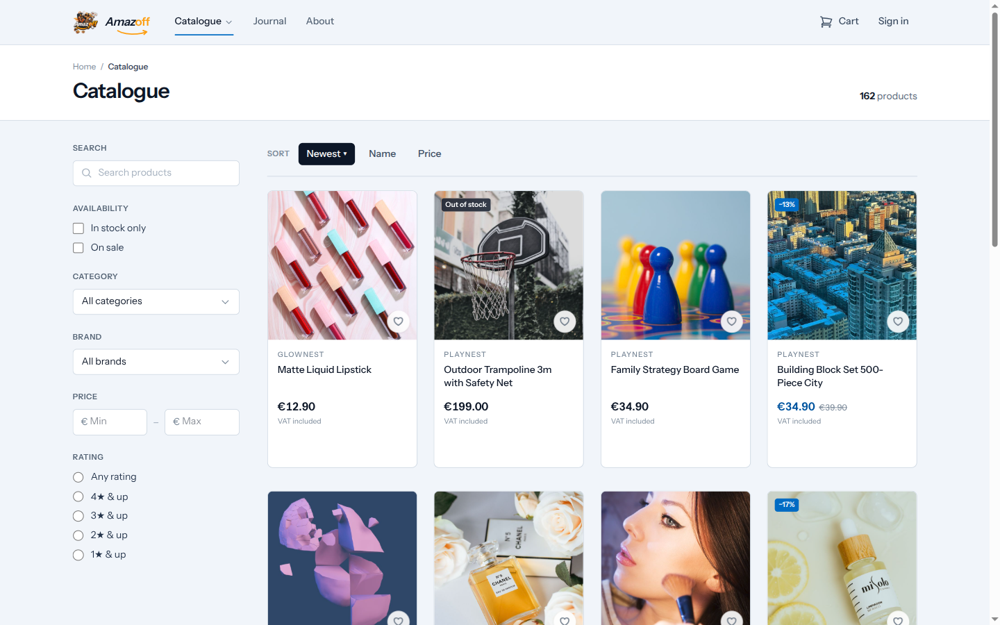
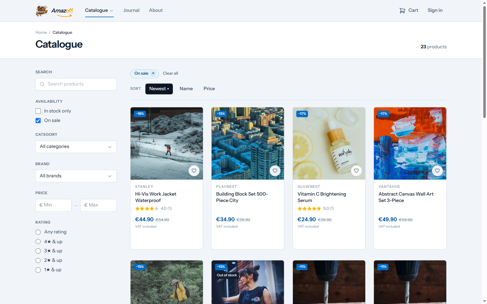
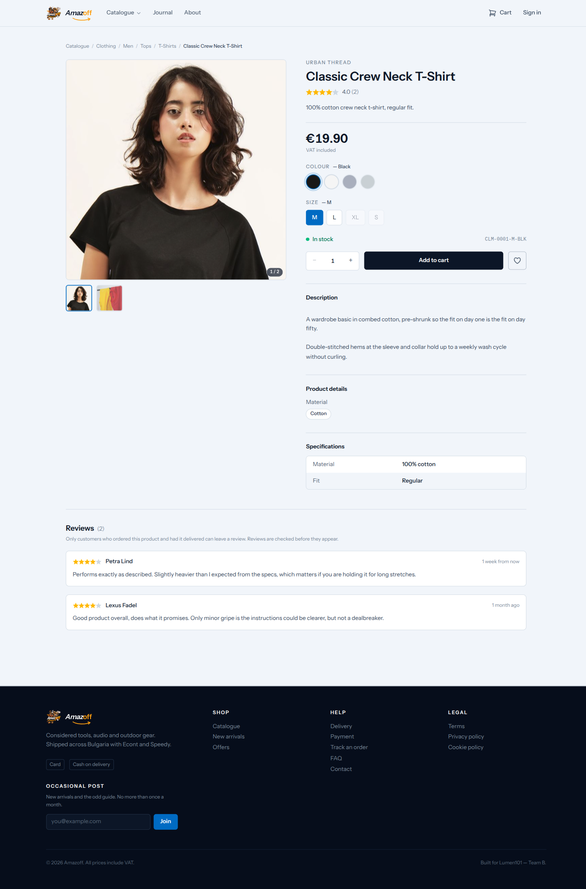
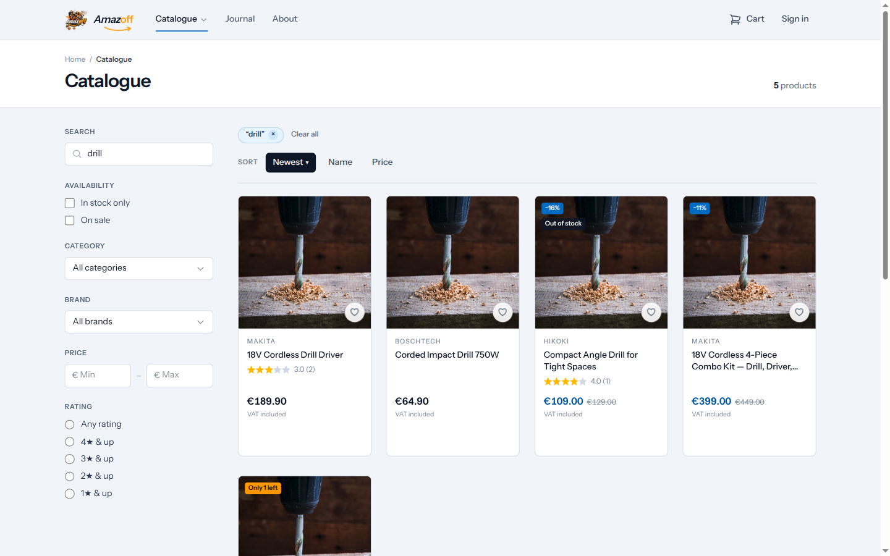
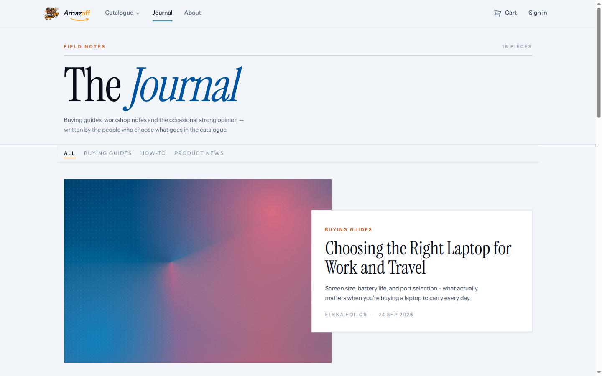
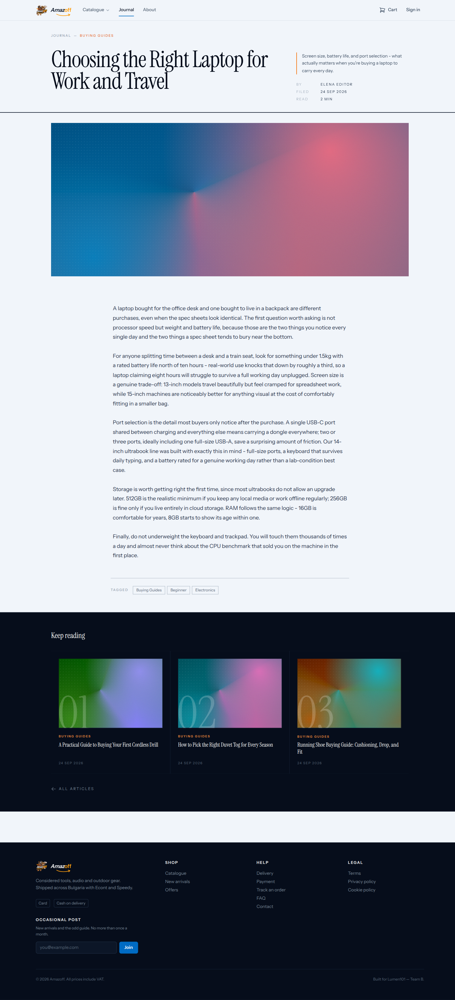
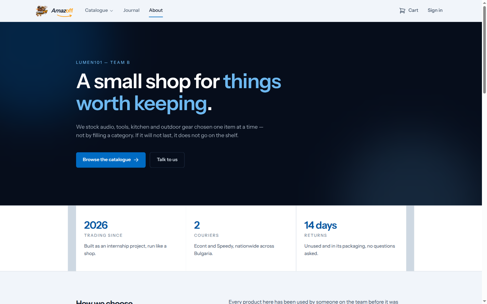
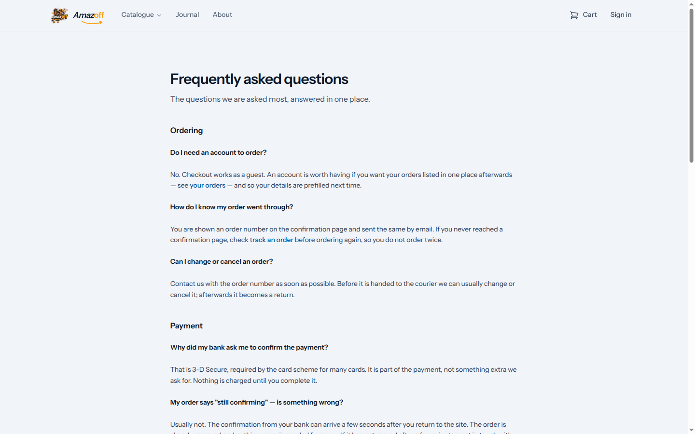
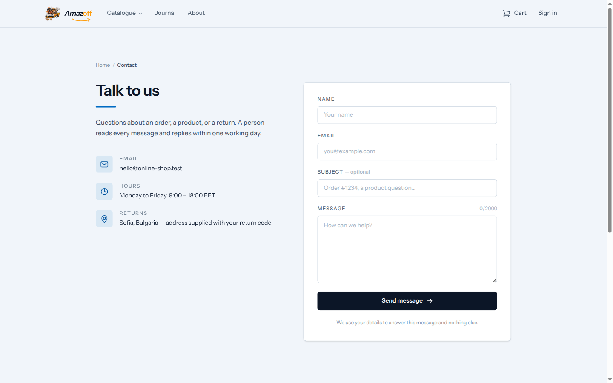
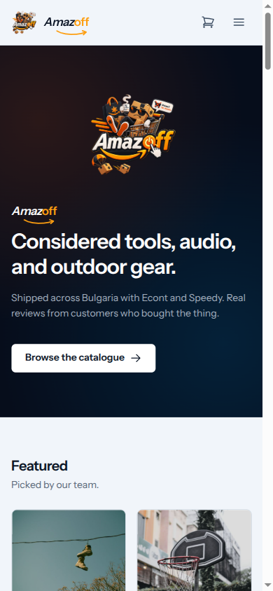

# Storefront browsing

Anonymous visitor's path through the catalogue and content pages. No login
required for anything on this page.

## Home page

Featured products, on-sale items, new arrivals, and popular products, each
pulled from the catalogue by a different query. A "From the journal" strip
links into the blog. Real photos throughout — product and article images are
fetched from Pexels during seeding, not placeholders.

## Catalogue with filters

162 seeded products. Filters: free-text search, in-stock-only, on-sale-only,
category, brand, price range, and a minimum star rating. Sort by newest,
name, or price.

The "On sale" filter applied — the result set and the `−13%`/`−17%` badges
update live via Livewire, no full page reload.

> **Under the hood:** catalogue reads go straight to Eloquent rather than
> through an Action — a read has no invariant to enforce, so there's nothing
> for an Action to own (ADR-0014, "How a storefront page reads"). The
> `is_available` filter is applied at two levels: the product flag **and**
> a `whereHas('productVariations', is_available)` check, because a product
> can be flagged available while every variation underneath it is sold out —
> the product flag alone would show items with nothing actually buyable.

## Product detail

A well-populated example: 2 images, 4 colour/size variation combinations
with independent stock levels (only in-stock combinations are selectable —
Navy and XL are greyed out here because that specific combination is out of
stock), and 2 customer reviews with star ratings. The SKU shown
(`CLM-0001-M-BLK`) is the *variation's* SKU, not the product's — each
colour/size combination carries its own SKU, stock count, and optionally its
own price override.

> **Under the hood:** reviews are gated — "Only customers who ordered this
> product and had it delivered can leave a review" — enforced by
> `CreateProductReview`, which requires an authenticated reviewer (no guest
> reviews) and checks the purchase before accepting a review
> (`ReviewNotAllowedException` otherwise). New reviews aren't shown until an
> administrator approves them (`approve_product_review` — see the
> [admin walkthrough](06-admin-administrator.md)).

## Search

Same catalogue component, driven by the search box — the URL carries the
query string (`?search=drill`) so results are linkable and shareable.

## Journal (blog)

Articles grouped by category (How-To, Product News, Buying Guides, Workshop
Tips).

A full article with rich-text content, author, and publish date.

> **Under the hood:** article bodies are user input from the admin's rich
> editor, purified before rendering (`stevebauman/purify`, ADR-0015) — the
> raw HTML is never trusted directly, since `{!! !!}` in Blade escapes
> nothing on its own.

## Static pages

About, Delivery, Payment information, FAQ, Terms, Privacy, and Cookie policy
all exist as their own routes. Two representative examples:

## Contact and newsletter

A contact form (name, email, message) that writes a `contact_messages` row
and emails a copy to the shop inbox; a newsletter signup field appears in
every page footer.

> **Under the hood:** neither `contact_message` nor `newsletter_subscriber`
> has a `create` permission in the admin panel — both are written only by
> these public forms, so a `create_*` permission for either could only ever
> be ticked by mistake (`docs/reference/permissions.md`). Both are also
> **deleted outright** (not anonymized) on a GDPR erasure request, since
> neither has a retention basis once the customer withdraws consent.

## Mobile view

One representative mobile-width capture of the header/nav — resizing a
desktop window isn't the same as testing a phone, but this shows the
collapsed layout at a glance:

