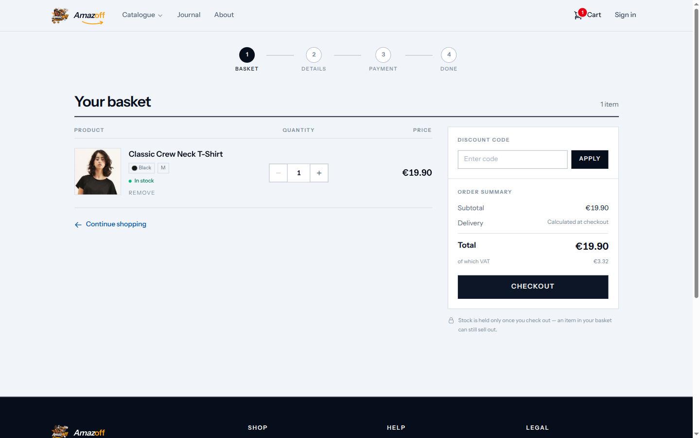
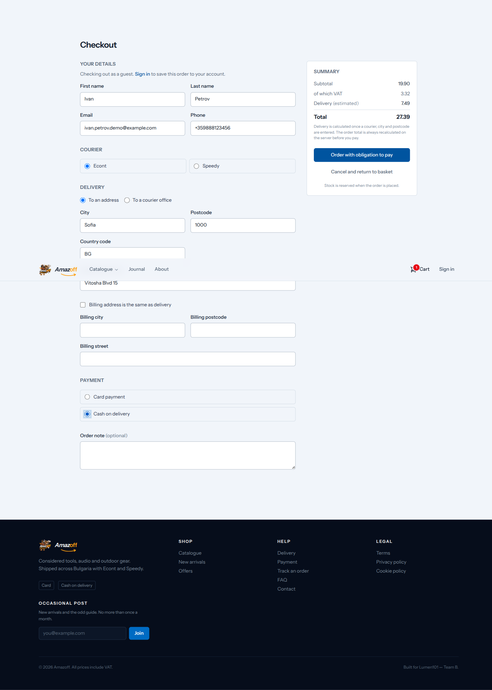
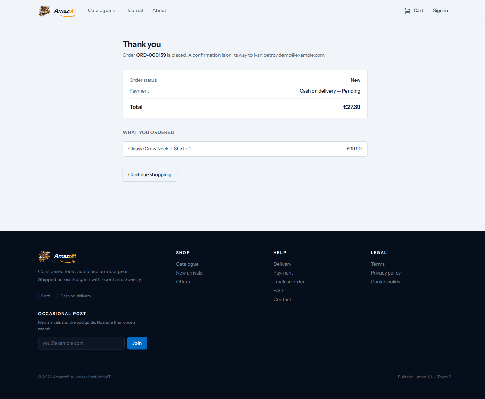
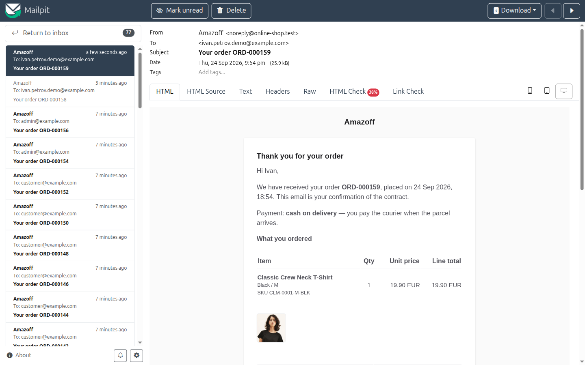

# Cart and checkout

A full guest checkout, paid cash-on-delivery, from add-to-cart through to the
confirmation email.

## Adding to cart

Adding the Classic Crew Neck T-Shirt (Black, size M) from its product page.
The cart icon in the header updates immediately.

## Cart page

Line items with quantity steppers, a discount-code field, and a running
order summary (subtotal, delivery — "calculated at checkout", total, VAT
breakdown). A note under the summary: *"Stock is held only once you check
out — an item in your basket can still sell out."*

> **Under the hood:** that note is literal. Nothing in the cart reserves
> stock — `CreateOrder` reserves it once, at order creation, rather than
> holding it provisionally earlier and transferring the hold. Zero hold
> window, zero abuse surface from someone filling a cart and never checking
> out.

## Checkout — guest, cash on delivery

Guest checkout (no account required — a banner offers signing in to save the
order to an account instead). Courier choice (Econt/Speedy), delivery to an
address or a courier office, and payment method (card or cash on delivery).
Delivery cost is calculated once a courier, city, and postcode are entered —
the summary here shows the delivery fee added after that, before final
submission.

> **Under the hood:** the total shown is provisional. `CreateOrder`'s
> function signature carries **no total input at all** — it recomputes
> `subtotal_amount`/`vat_amount`/`total_amount` from the cart's *current*
> contents server-side, so there's no field for a tampered client-side total
> to land in. Each order line also snapshots its product name, SKU, variation
> name, and price at the moment of purchase (`order_items`), frozen against
> any later catalogue edit — so a price change tomorrow doesn't rewrite
> today's receipt.

## Order confirmation

The order is placed (`ORD-000159` in this run) and lands at `OrderStatus::New`
regardless of payment method chosen.

> **Under the hood:** `CreateOrder` never advances the order off `New` — the
> caller takes the first hop. For a card payment, `CheckoutPage::placeOrder`
> immediately transitions `New → AwaitingPayment` right after the Stripe
> intent is created; a cash-on-delivery order stays at `New` until staff
> confirm it. `TransitionOrderStatus` — the only writer of `orders.status`
> anywhere in the codebase — is what performs that move, not a direct column
> assignment. A card order that reaches the Stripe step but is never paid for
> is automatically cancelled and its stock released by a scheduled sweep
> (`orders:expire-unpaid`, every minute) once it's been sitting unpaid too
> long.

## Order confirmation email

Caught by Mailpit rather than sent to a real inbox. Subject line includes the
order number; the body restates payment method and what happens next
("cash on delivery — you pay the courier on delivery").

### Optional: the Stripe card path

Not captured in this walkthrough — this run used cash-on-delivery
specifically to avoid needing real Stripe test cards. The card path exists
and uses Stripe Payment Intents with Elements (not Checkout Sessions,
ADR-0016) rendered inline on the checkout page; `docs/how-to/set-up-stripe.md`
has the test card numbers if you want to exercise it directly against the
running app.

> **Under the hood:** the Stripe webhook that confirms a card payment sits
> **outside** the app's normal `web` middleware group entirely — no session,
> no cookies, no CSRF token to exempt — and is authenticated instead by
> `VerifyStripeWebhookSignature`, which verifies Stripe's signature on every
> request before any business logic runs. CLAUDE.md states this as one rule,
> not two: CSRF-exclusion *and* signature-verification, together — either one
> alone is a free-products vulnerability.
