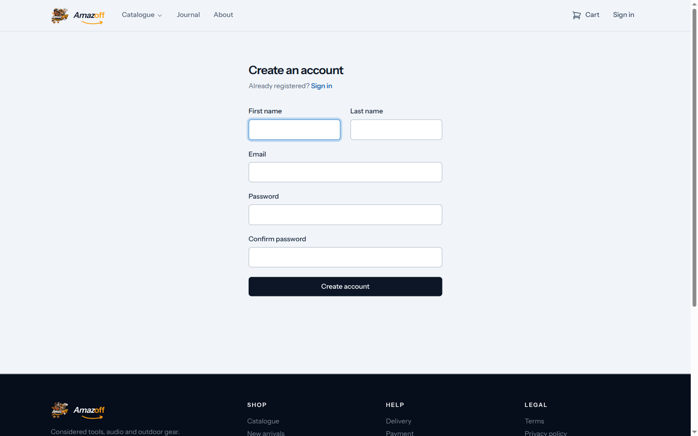
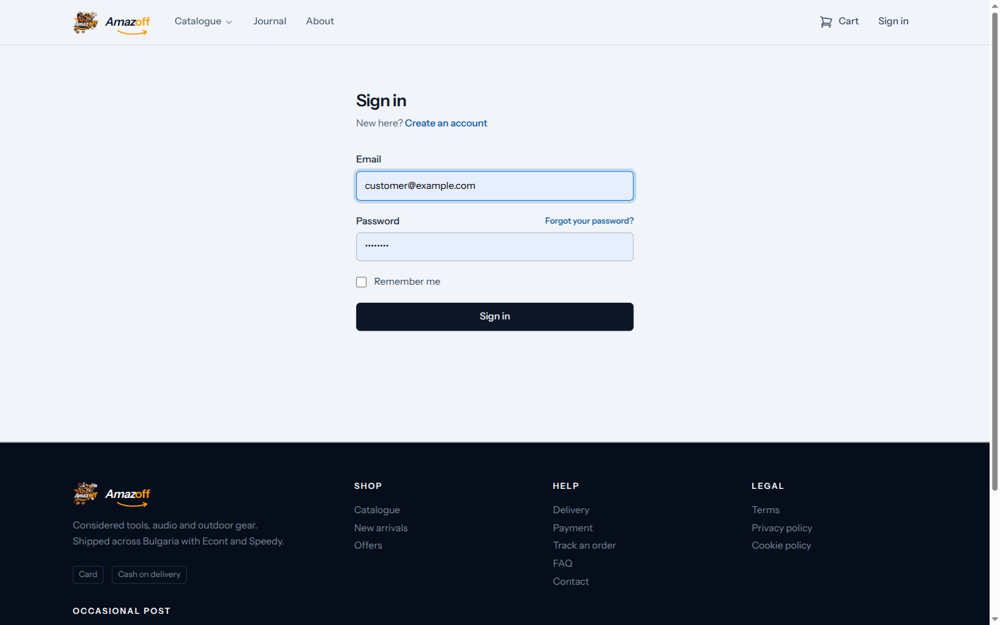
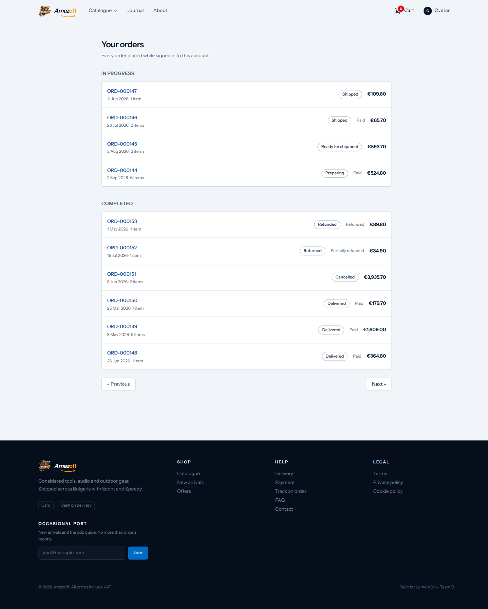
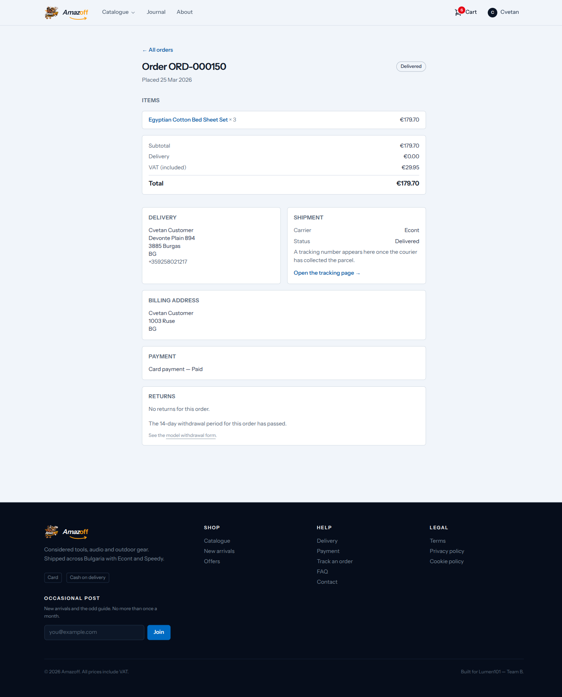
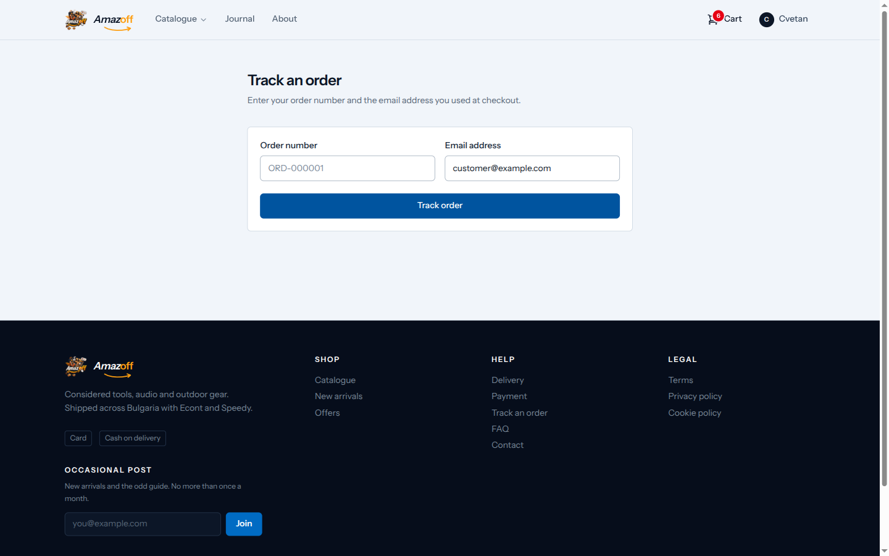
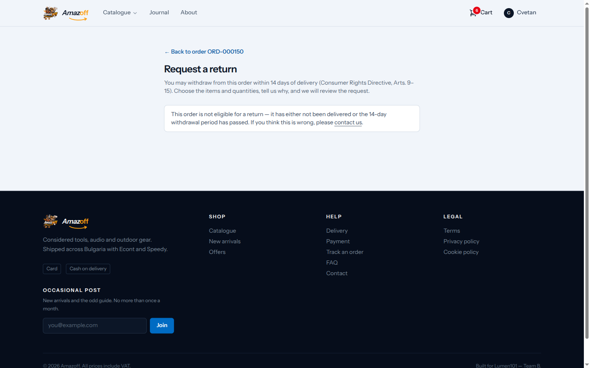
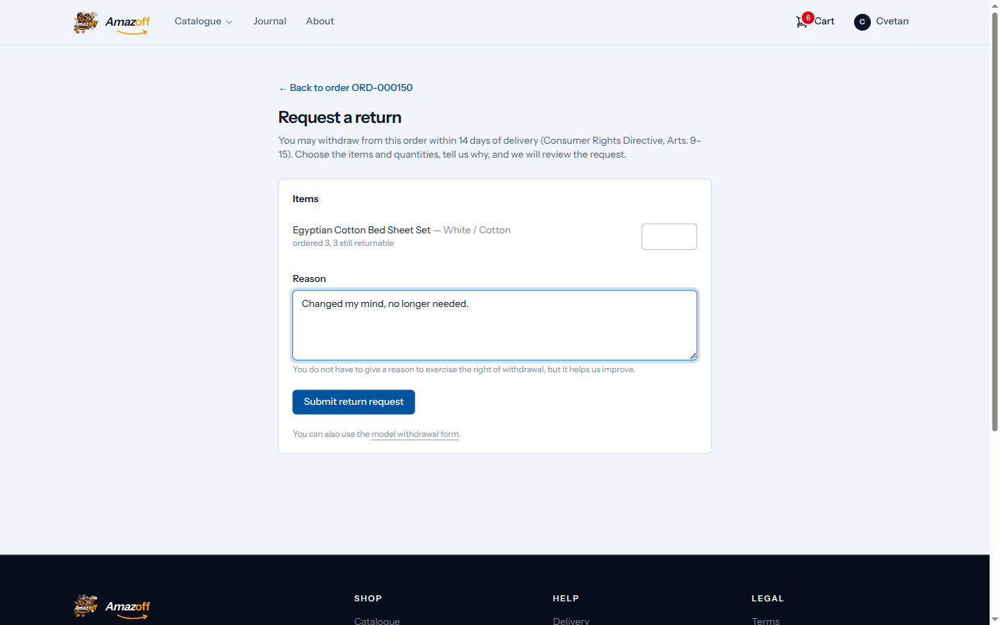
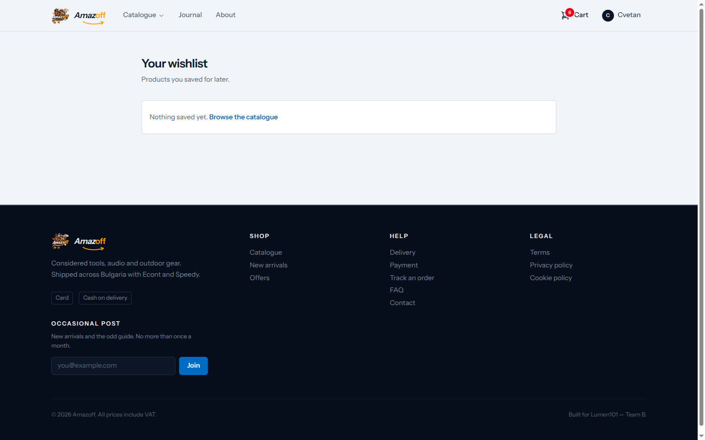
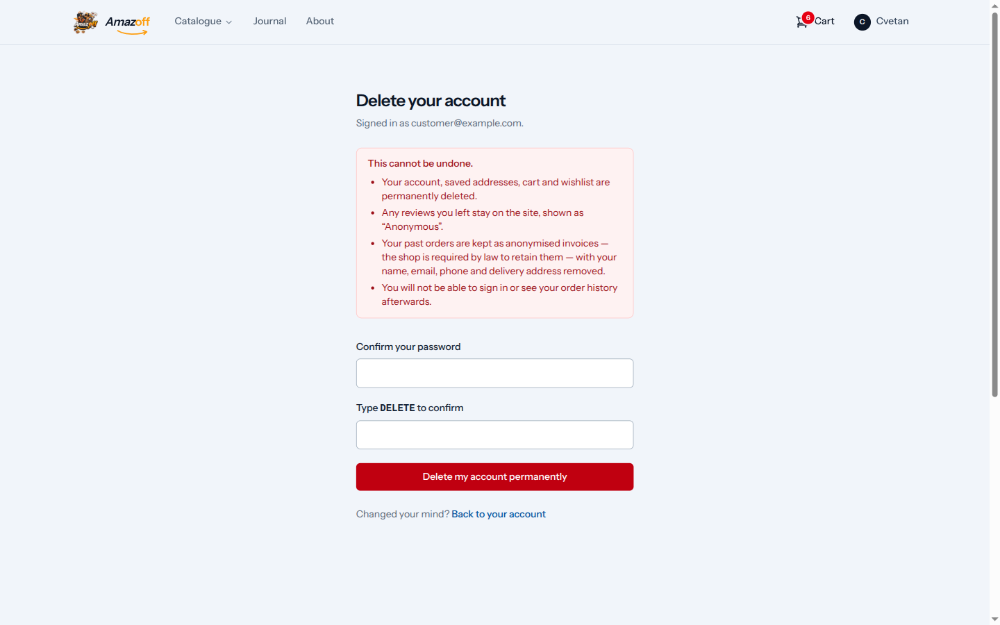

# Customer account

Everything a logged-in customer can do, using `customer@example.com` — this
account was seeded with orders in all 11 possible order statuses so the
order-history states are all visible in one list.

## Register and login

Standard email/password. "Remember me" and a password-reset link are
present.

## Order history — every status

Grouped into "In progress" (New, Awaiting payment, Confirmed, Preparing,
Ready for shipment, Shipped) and "Completed" (Delivered, Cancelled, Returned,
Refunded, Partially refunded) — this one account has orders in every one of
them, from a €3,935.70 cancelled order down to a €34.90 returned item.

> **Under the hood:** every status transition here — cancelled, returned,
> refunded, whatever's shown — was written exclusively by
> `TransitionOrderStatus`. There is no code path anywhere in the app that
> assigns `orders.status` directly; that's a hard rule (`CLAUDE.md`,
> `docs/reference/coding-conventions.md`), because the Action is also what
> keeps the inventory ledger consistent with the status — cancelling releases
> reserved stock, shipping completes the sale, returning restocks — as one
> atomic move instead of something a caller could get half-right.

## Order detail

Line items, addresses, payment status, and totals for a single order.

## Order tracking (no login required)

A separate, public flow for anyone with just the order number and the email
it was placed under — useful for a guest checkout that never created an
account.

> **Under the hood:** this deliberately requires **both** the order number
> and the matching email, not the order number alone — sequential order
> numbers (`ORD-000159`, `ORD-000160`, ...) would otherwise let anyone
> enumerate every customer's order just by incrementing a URL. This is one of
> the security rules this project states as its own, not something the
> framework gives for free.

## Requesting a return

Most of this account's delivered orders are outside the 14-day window, so
opening the return form on one of them shows the actual refusal a customer
would see — not a crash, a clear message pointing to Contact for an
exception.

On an order still inside the window, the form lets the customer pick which
lines and quantities to return and give an optional reason (giving a reason
is explicitly optional — "You do not have to give a reason to exercise the
right of withdrawal").

> **Under the hood:** `RequestReturn` enforces the 14-day right of withdrawal
> (Consumer Rights Directive, Arts. 9–15) against the `Delivered` status
> history row's own timestamp, not against `updated_at` or any other
> mutable field. It refuses — as a normal form error, never a 500 — when the
> order hasn't reached `Delivered` yet, when the window has passed
> (`ReturnNotAllowedException::windowExpired`), when nothing is selected, or
> when a requested quantity exceeds what's left un-returned on that line.
> A refusal writes nothing at all — no `returns` row, no `return_items`.
> Approving and refunding a request is a staff action covered in the
> [administrator walkthrough](06-admin-administrator.md).

## Wishlist

Products saved from the catalogue's heart icon. Empty by default; shown here
after saving one item.

## Account deletion

Shown, not exercised — deleting the seeded demo account isn't part of this
walkthrough. The page requires typing the current password and a literal
confirmation before it's enabled.

> **Under the hood:** this is GDPR Article 17 erasure
> (`docs/reference/write-rules/gdpr.md`), and it's **not a hard delete of
> everything** — it's a mix, decided per table by what legally has to
> survive. The `users` row itself is force-deleted. But `orders` rows
> **survive**: every amount, status, and serial number stays intact (that's
> the accounting record), while `email`, `first_name`/`last_name`, and
> `phone` are overwritten to anonymized placeholders. `order_status_histories`
> keeps its full audit trail with only `user_id` nulled. Tables with no
> retention basis — `newsletter_subscribers`, `contact_messages`, saved
> `addresses`, cart and wishlist rows — are deleted outright via cascade.
> Running this twice is safe: only orders with `anonymized_at IS NULL` are
> rewritten, so a retry or a race with a second erasure request touches
> nothing the second time.
