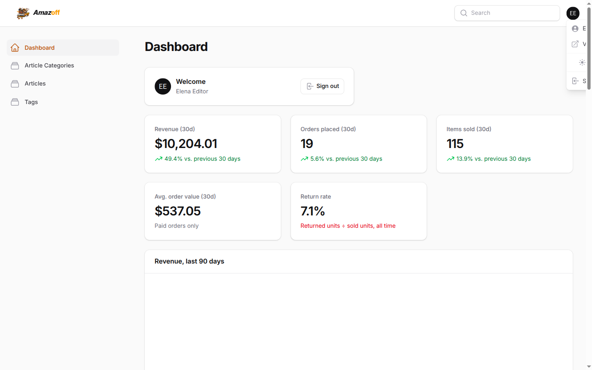
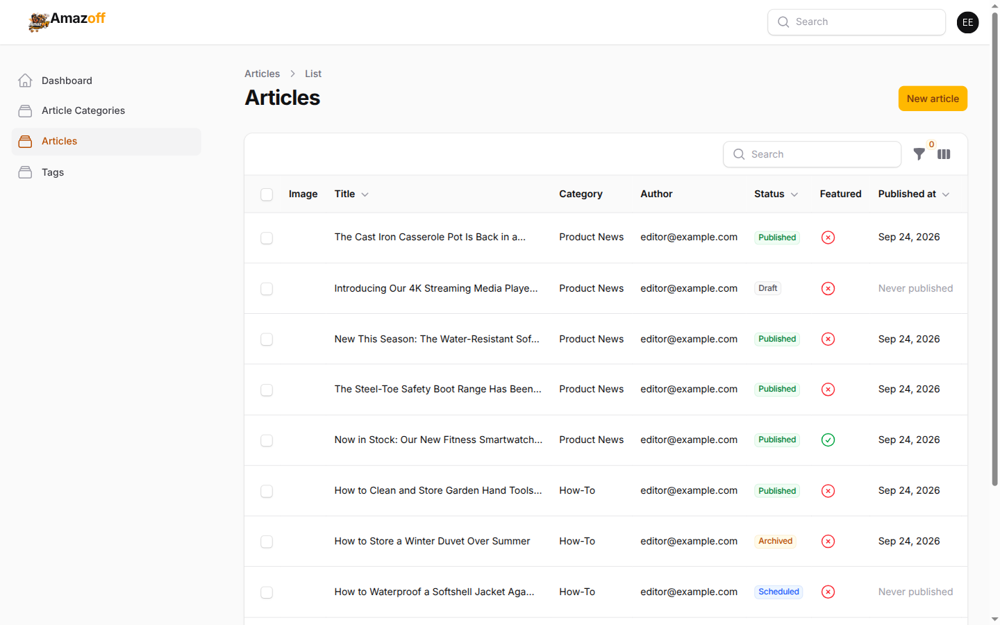
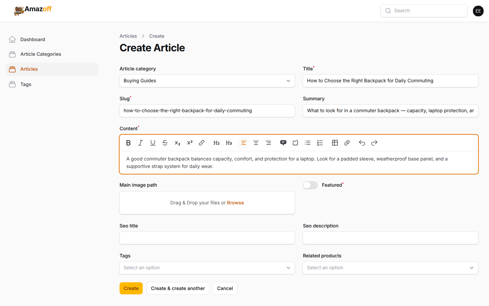
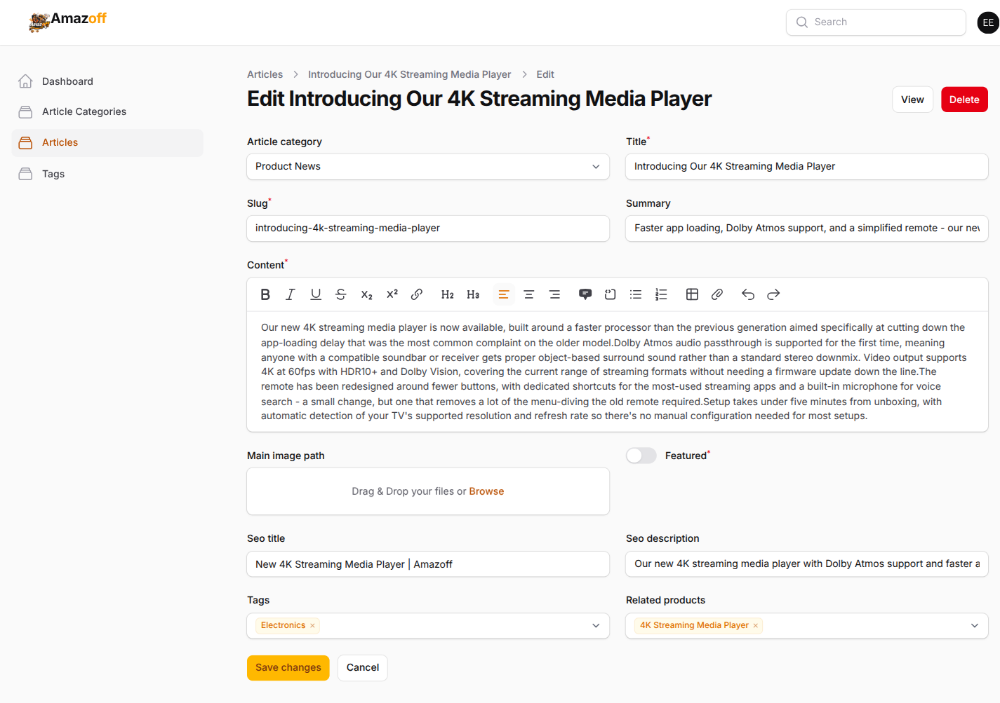
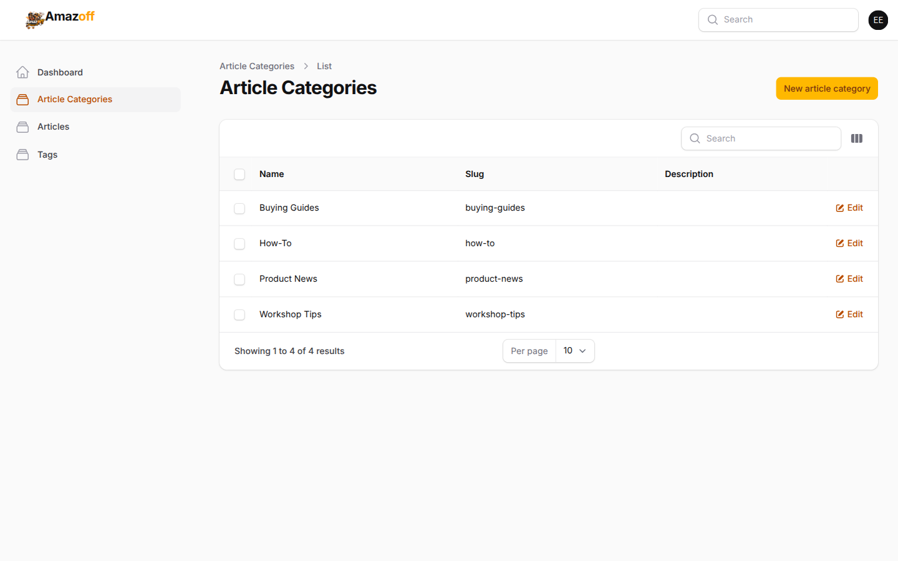
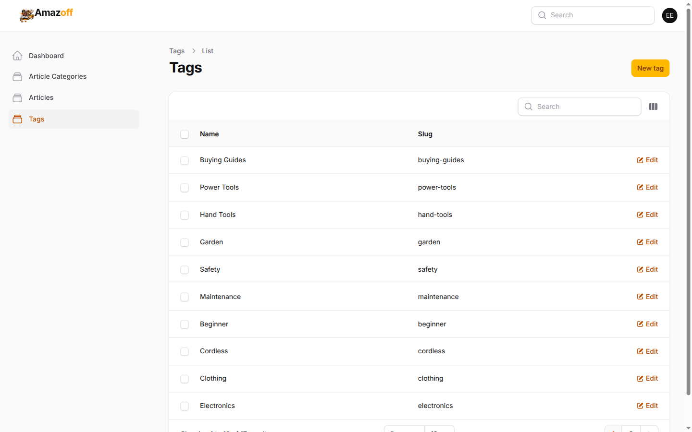

# Admin panel — Content Editor

Logged in as `editor@example.com` (role `content_editor`).

## The role-limited sidebar

The sidebar shows exactly four entries: **Dashboard**, **Article
Categories**, **Articles**, **Tags**. Compare this to the
[administrator's full sidebar](06-admin-administrator.md) — same panel,
same login screen, a completely different set of resources reachable,
because Filament asks the permission system what to show rather than the
editor's URL bar being trusted.

> **Under the hood:** this is `content_editor`'s exact grant — 16
> permissions total, full CRUD on `article` (plus `publish`),
> `article_category`, and `tag`, nothing else
> (`docs/reference/permissions.md`). `payment`, `carrier` (courier
> credentials), `user`/`role`, and `setting` are denied **by name** in the
> spec this role was built against, not merely omitted. Typing
> `/admin/orders` directly as this user would 403, not just hide the link —
> the permission check happens on the resource itself
> (`OrderPolicy::viewAny`), not only in the sidebar's own rendering.

## Articles list

24 seeded articles across every status this app supports: Published, Draft,
Archived, and Scheduled — visible together in one table, along with which
ones are flagged "Featured".

## Creating an article

The create form: category, title (slug auto-derives from it), summary, a
rich-text editor for the body, a cover-image uploader, a required "Featured"
toggle, SEO title/description, tags, and related products.

> **Under the hood:** `article_category_id` is the only field on this form
> that *isn't* required — a draft with no category yet is a half-entered
> record, not a broken one. Everything the customer eventually sees is
> purified before it reaches the storefront: article bodies are user input
> from this same rich editor, run through `stevebauman/purify` (ADR-0015) at
> render time, because `{!! !!}` in Blade escapes nothing on its own.
> `PublishArticle` — the Action that actually flips `published_at` — is
> deliberately kept separate from an ordinary field edit: §22 of the spec
> treats publication as its own distinct act with its own permission
> (`publish_article`), so an editor can be given the ability to draft
> content without also being able to make it public.

## Editing an existing article

The same form, pre-filled, for an existing draft ("Introducing Our 4K
Streaming Media Player"). Every article in the list carries an **Edit**
link and a **Change status** action for moving it through
Draft → Scheduled/Published → Archived.

## Article categories

Buying Guides, How-To, Product News, Workshop Tips — the four categories
articles are grouped under, both here and on the storefront Journal index.

## Tags

Freeform tags attachable to any article, used for the storefront's related-
content links.
