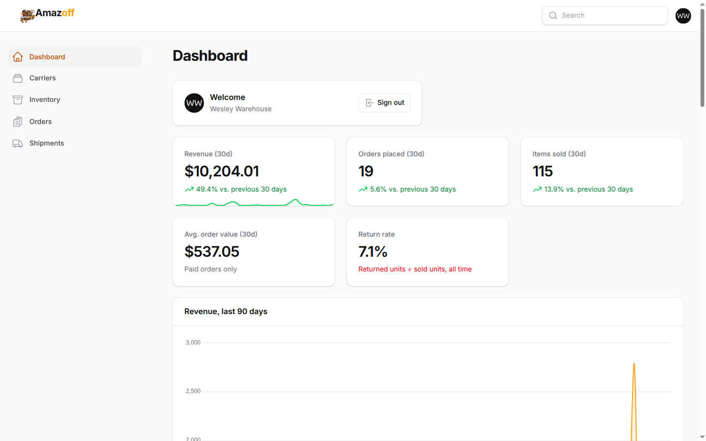
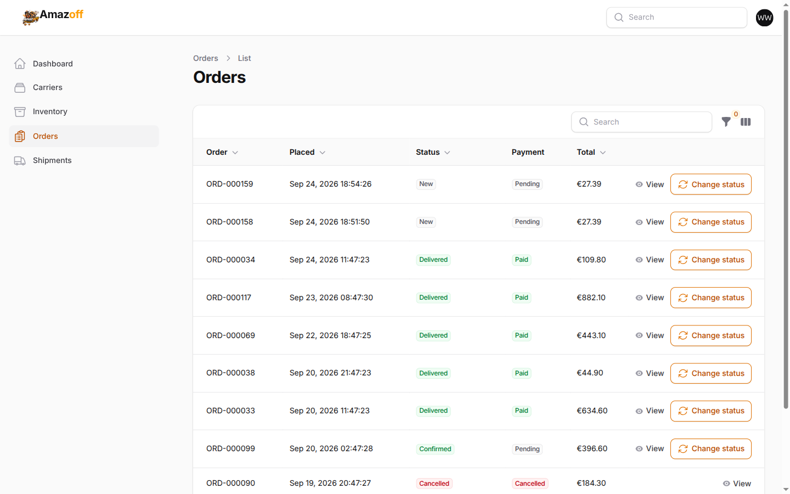
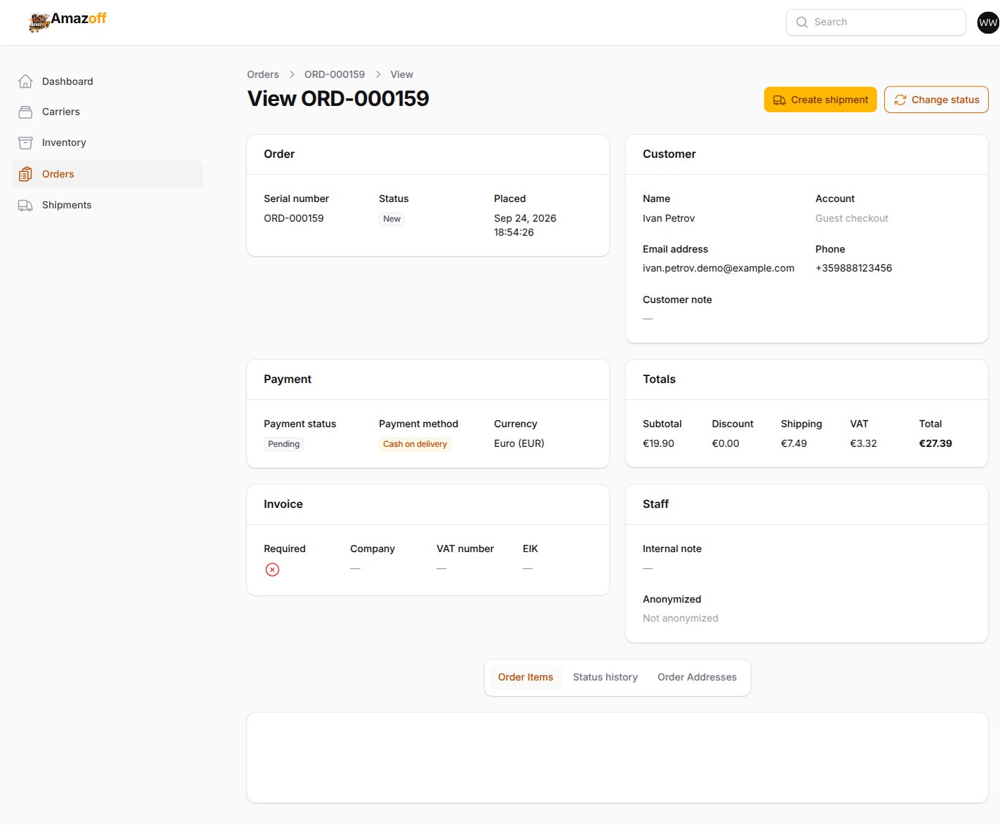
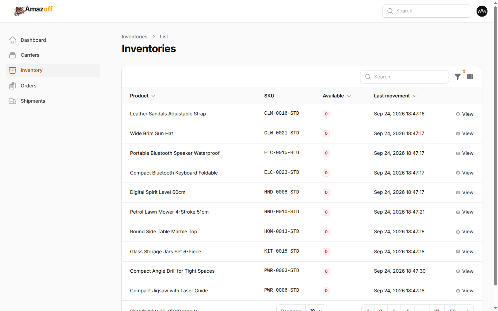
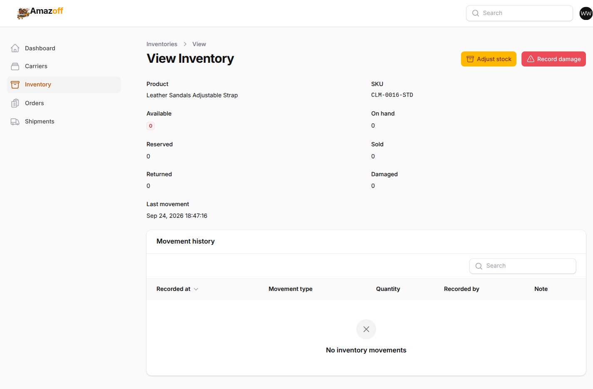
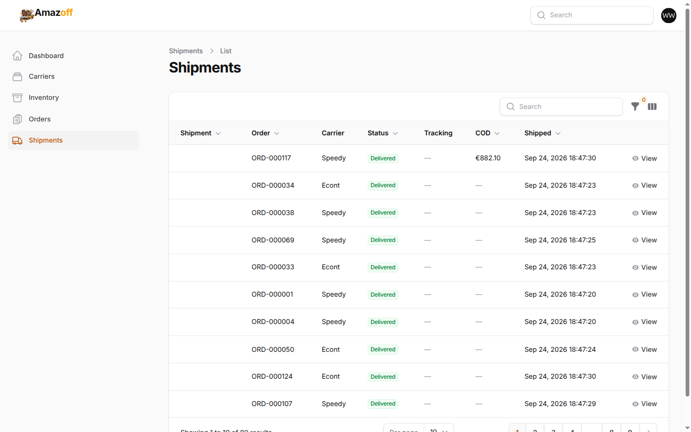
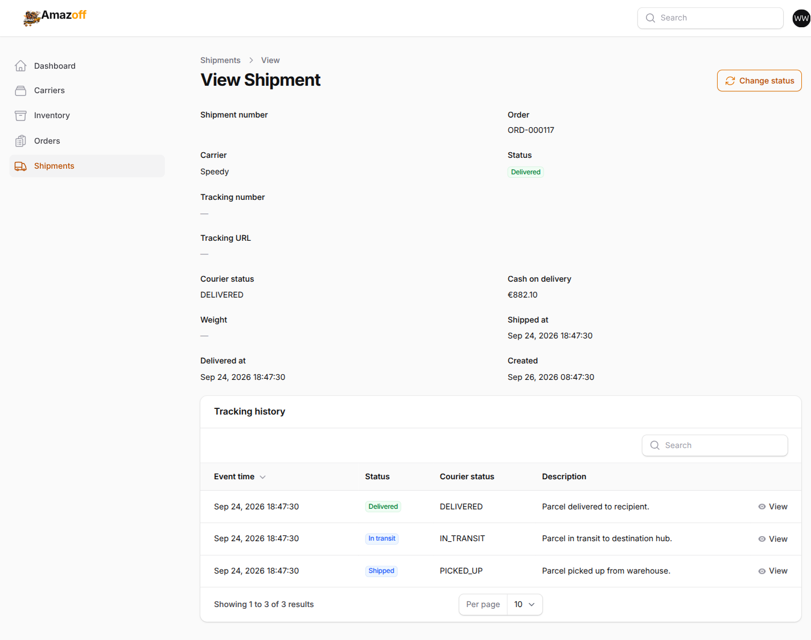
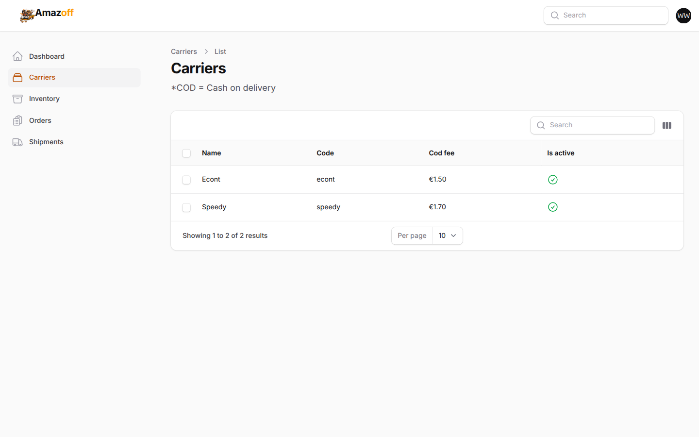

# Admin panel — Warehouse Employee

Logged in as `warehouse@example.com` (role `warehouse_employee`).

## The role-limited sidebar

Five entries: **Dashboard**, **Carriers**, **Inventory**, **Orders**,
**Shipments**. No Products, no Articles, no Users, no Payments — this role
is scoped to fulfilment, not the catalogue or money.

> **Under the hood:** 12 permissions total
> (`docs/reference/permissions.md`). On `order`, this role holds `viewAny`,
> `view`, `updateStatus`, and `addInternalNote` — but **not** `cancel` or
> `refund`, which ADR-0011 reserves for the administrator alone. On
> `carrier` it holds only `viewAny` — picking a courier at checkout isn't
> the same as administering courier credentials, so this role can see the
> Econt/Speedy rows but never edit them.

## Orders list

159 seeded orders, searchable and sortable by status, payment, and total.

## Order detail and the status-change action

A guest cash-on-delivery order just placed during this walkthrough
(`ORD-000159`, status **New**). Two actions in the header: **Create
shipment** and **Change status**.

> **Under the hood:** the **Change status** menu is generated per logged-in
> role, from the same underlying code both roles share — it isn't two
> different UIs. `OrderResource` asks `updateStatus_order` once per
> *possible target status* and only lists the ones the current actor is
> allowed to move to. A warehouse employee sees the routine forward
> advances (Confirmed → Preparing → Ready for shipment → Shipped →
> Delivered); an administrator viewing the identical order sees those
> **plus** Cancel and Refund, because those two routes to `cancel_order`/
> `refund_order` instead of the ordinary `updateStatus_order` ability
> (ADR-0011). Whichever status is picked, the write goes through
> `TransitionOrderStatus` — the only code path anywhere that writes
> `orders.status` — which also fires the matching inventory effect
> (releasing reserved stock on cancellation, completing the sale on
> shipment) as part of the same transaction, not as a separate step a
> caller could forget.

## Inventory

219 SKU-level stock rows across every product variation, with an
"Available" column and last-movement timestamp.

A single SKU's full stock picture: available, on hand, reserved, sold,
returned, damaged — plus a movement-history log. **Adjust stock** and
**Record damage** actions sit in the header.

> **Under the hood:** `AdjustStock` is one of the Actions in
> `app/Actions/Inventory` that the write-rules doc is explicit about —
> stock counts are contested state, so any write against them runs inside
> `DB::transaction` + `lockForUpdate()` on the row the invariant actually
> lives on, not just on whatever's being written. This inventory screen
> was added specifically so `warehouse_employee` has a path to this Action
> at all — an earlier audit found the permission granted with no panel
> route reaching it, since the only pre-existing UI for stock adjustment
> was nested inside the Products resource, which this role can't open.

## Shipments

89 shipments, each tied to an order and a carrier, with COD amount and
ship date columns.

A single shipment's carrier, tracking status, and timeline.

> **Under the hood:** creating a shipment is reachable only from an order's
> own page (the **Create shipment** button shown above), not as a
> standalone form — because `CreateShipment` refuses a shipment for a
> cancelled, unpaid, or already-shipped order, and a standalone "pick any
> order" form would just invite picking a bad one and hitting that refusal
> immediately. Doing it from the order page instead means the order is
> already known to be shippable before the button even appears.

## Carriers — read only

Econt and Speedy, visible for reference when choosing a courier, but with no
edit access — this role holds `viewAny_carrier` only.
