# Admin panel — Administrator

Logged in as `admin@example.com` (role `administrator`).

## The full sidebar

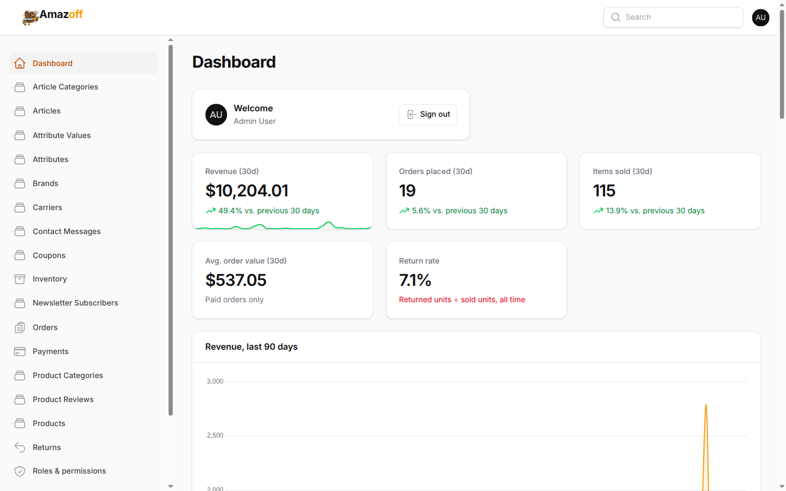

Every resource in the panel: Article Categories, Articles, Attribute Values,
Attributes, Brands, Carriers, Contact Messages, Coupons, Inventory,
Newsletter Subscribers, Orders, Payments, Product Categories, Product
Reviews, Products, Returns, Roles & permissions, Shipments, Tags, Users —
21 resources total.

> **Under the hood:** the administrator role holds **zero** explicit
> permission rows in the database — access comes from `Gate::before` in
> `AppServiceProvider`, which short-circuits to `true` before any individual
> policy method runs. That's a deliberate choice, not an oversight: attaching
> all 107 permissions to the role explicitly would drift every time the
> catalogue grows, whereas `Gate::before` never falls out of sync. One
> consequence worth knowing: **a policy method can never deny the
> administrator anything.** A rule shaped like "nobody may do X, not even the
> administrator" has to live inside the Action or the page itself, never in
> a policy — `UserPolicy::assignRole()` guards against self-promotion this
> way, in the page rather than the policy, for exactly that reason.

## Product management

### Products list

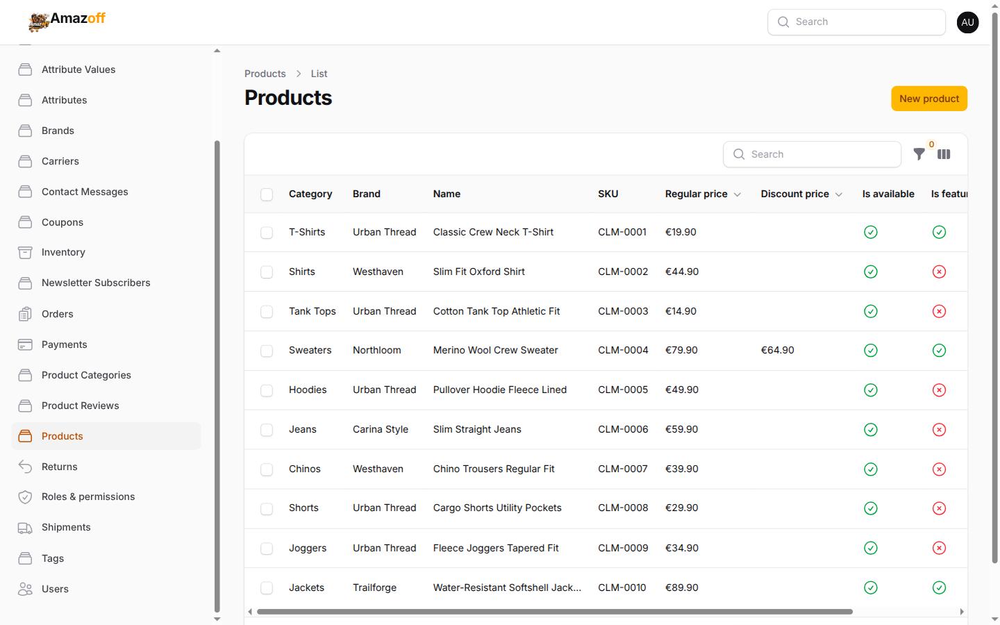

The full catalogue, searchable and filterable.

### Editing a product

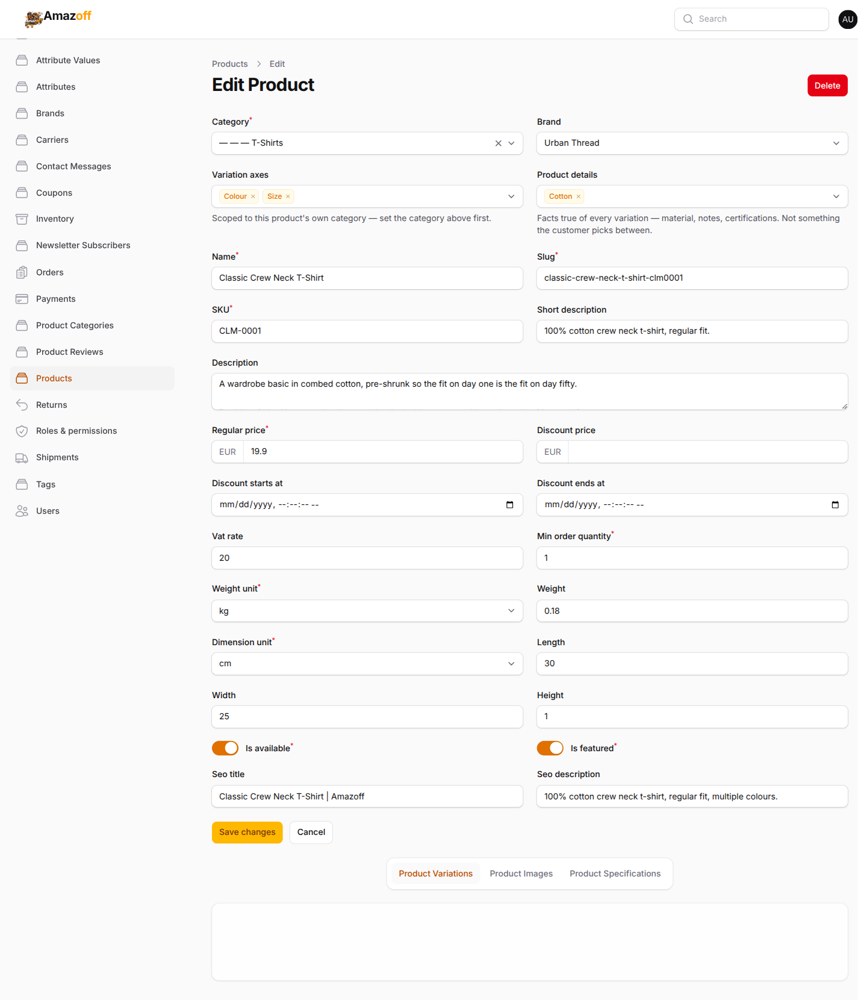

The Classic Crew Neck T-Shirt's edit screen — category, brand, variation
axes (Colour, Size — scoped to this product's own category), shared product
details (facts true of every variation, like "Cotton"), pricing, VAT rate,
weight/dimensions, and the Is available / Is featured toggles.

### Variations

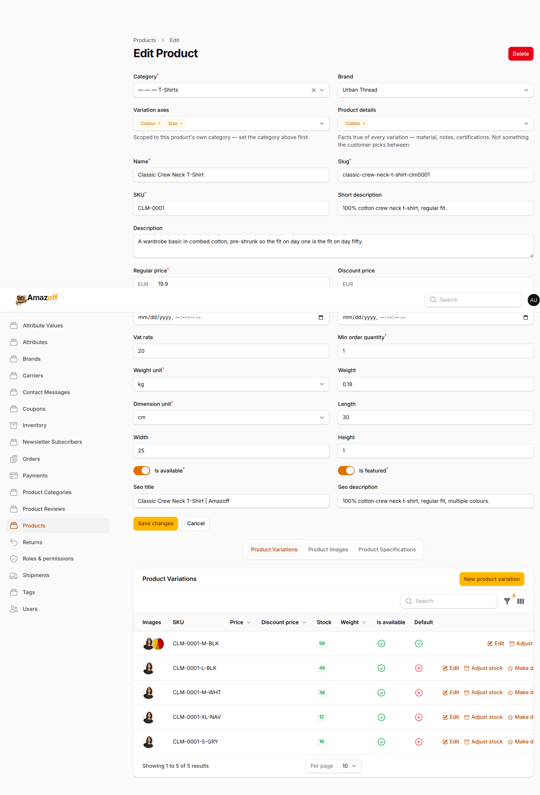

Five SKU-level variations under this one product (`CLM-0001-M-BLK`,
`-L-BLK`, `-M-WHT`, `-XL-NAV`, `-S-GRY`), each with its own stock count,
default flag, and per-row actions: Edit, Adjust stock, Make default, Images,
Delete.

> **Under the hood:** this project's convention for *content authoring* is
> the same vertical-slice discipline it uses for code — migration → model →
> factory → policy → admin resource → public UI, one entity fully before the
> next. Practically, building this product followed the same order: the
> category and brand had to exist first (they're plain lookup tables with
> Filament's default CRUD, no Action needed for those), then the product
> record itself, then each variation, then that variation's images, then its
> opening stock. Product images specifically go through
> `ProductVariationImagesRelationManager`, which enforces a minimum
> width/height (`Illuminate\Validation\Rules\Dimensions`), an accepted MIME
> list, and a max file size on upload — a variation can't own an image too
> small to render properly on the product page.
>
> A caveat worth being upfront about: `docs/reference/write-rules/product.md`
> notes that **no panel or storefront code calls the Catalogue Actions yet**
> for product/variation writes — the screens above reflect Filament's
> default CRUD behaviour today, not `CreateProduct`/`AddProductVariation`
> being called underneath. The invariants those Actions would enforce (a
> sellable product needs at least one variation, a soft-deleted product's
> variations become unreservable) are documented as the target shape, not
> yet wired into this UI.

## Catalogue lookups

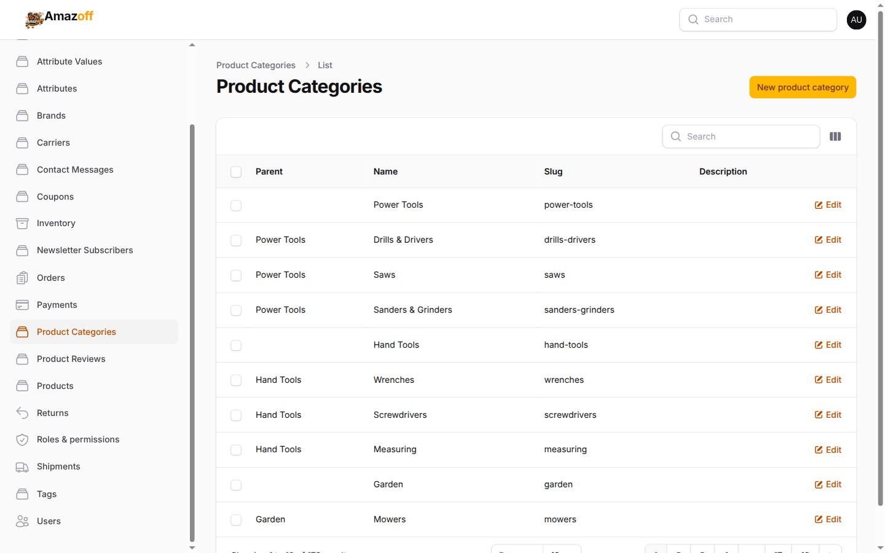

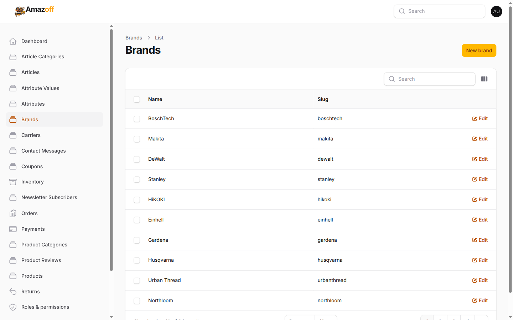

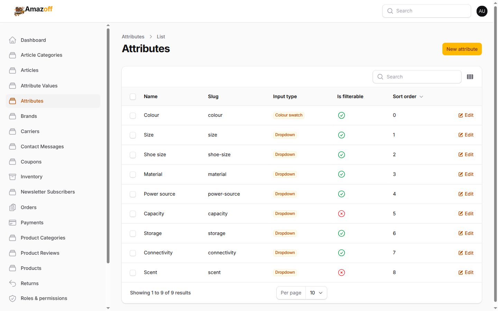

Product Categories, Brands, and Attributes/Attribute Values are all plain
lookup tables — Filament's default CRUD, no custom Action behind them,
because wrapping a single-table save in an Action would buy nothing here
(ADR-0007).

## Coupons

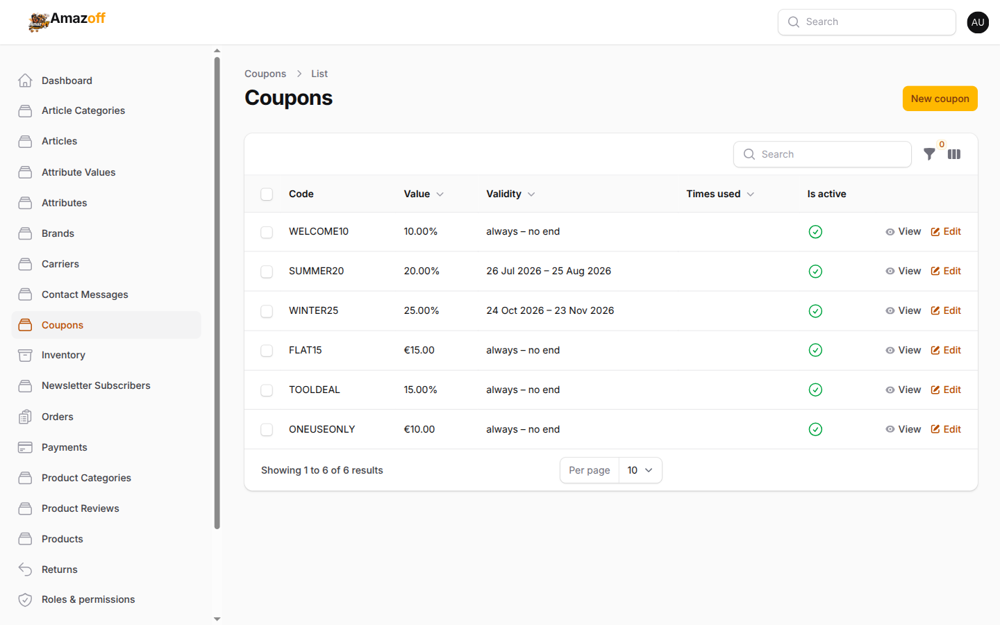

> **Under the hood:** the coupon *row* itself is ordinary CRUD, but coupon
> **redemption** is the actually-contested state — usage caps (total and
> per-customer) are enforced inside `CreateOrder`'s own transaction, with a
> lock on the relevant rows, not on the coupon row's own save. The
> per-customer cap is keyed by a hash of the order's email, not by
> `user_id` — so the same person checking out once as a guest and once
> logged-in, using the same email both times, is still correctly counted as
> one customer against that cap.

## Users & roles

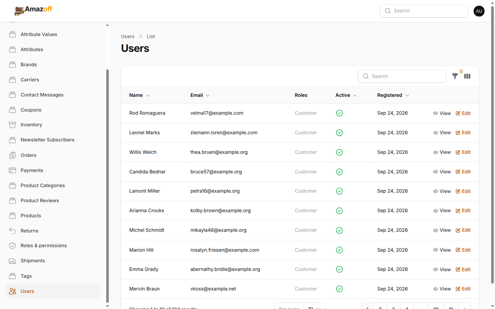

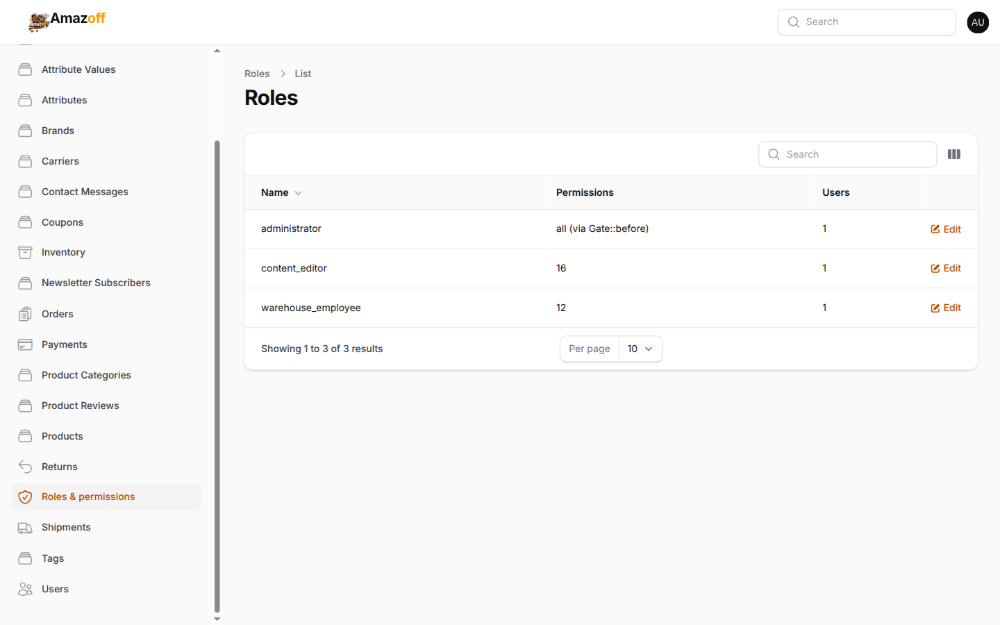

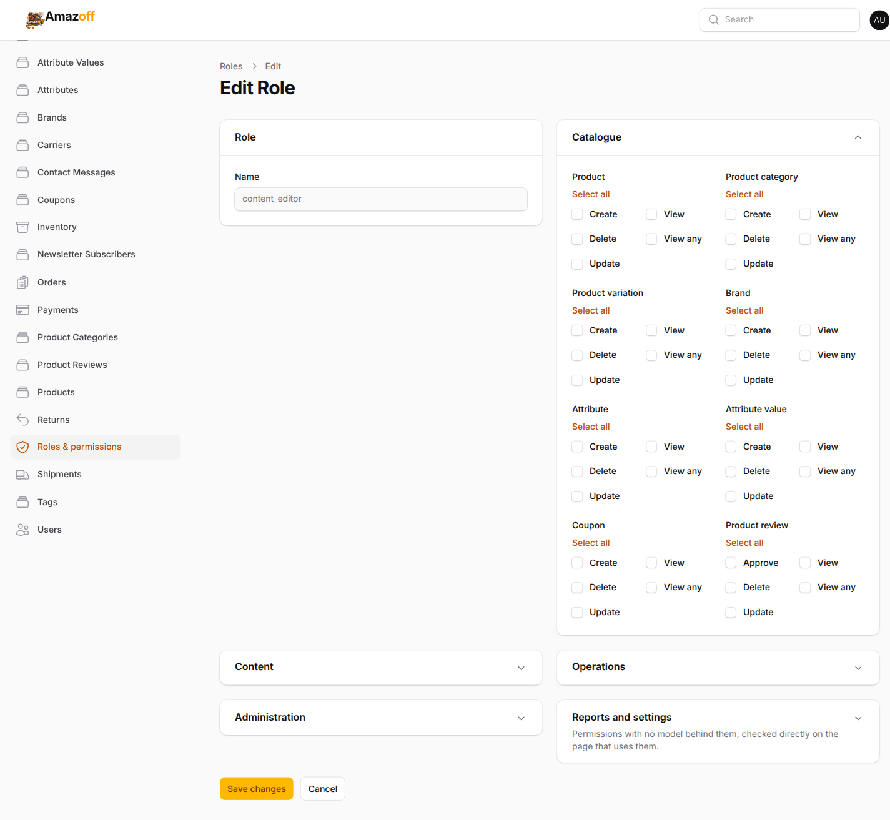

The `content_editor` role's edit screen — 16 permission checkboxes, grouped
by resource, matching exactly what its sidebar exposes in the
[content editor walkthrough](04-admin-content-editor.md).

> **Under the hood:** granting a role is deliberately **not** folded into
> the ordinary `update_user` permission — it's its own ability,
> `assignRole`, administrator-only. If it weren't separate, anyone holding
> `update_user` could grant themselves the administrator role and escalate
> straight past every other check in the system. Similarly, `erase_user`
> (GDPR Article 17 erasure done from the panel, for a request emailed to the
> shop) is distinct from `delete_user` — the latter is ordinary
> deactivation, the former is permanent and irreversible, and
> `UserPolicy::erase` additionally blocks an administrator from erasing
> *their own* account this way, since that would revoke their own panel
> access mid-transaction; self-erasure only happens through the storefront's
> own `/account/delete` path.

## Payments — read-only, with refund

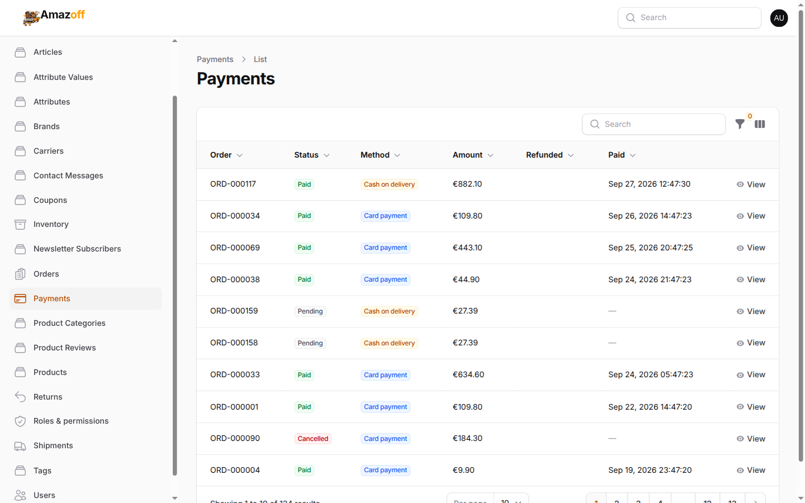

124 payment records. Every row is read-only except for one action.

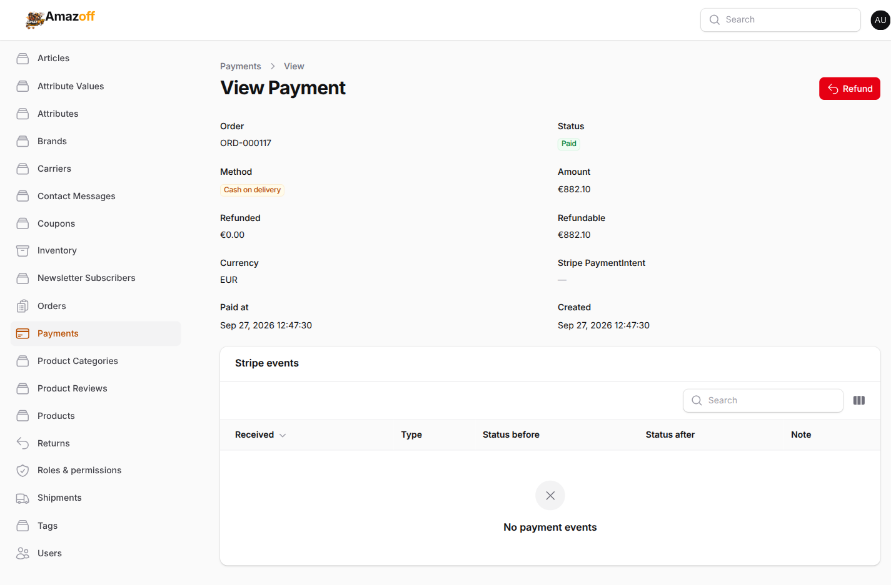

A paid card payment's detail screen, including its `payment_events`
relation manager — every webhook Stripe delivered for this payment, and a
`note` explaining why any event that didn't apply was skipped.

> **Under the hood:** there is no `create_payment` permission anywhere in
> the system, and it isn't an oversight — a payment row is written by the
> Stripe webhook alone (`RecordPayment`, called with **no actor**, since the
> webhook is authenticated by signature verification rather than by a
> logged-in user). `PaymentPolicy::create()` returns `false` unconditionally.
> The one write this screen allows is **Refund**, gated by `refund_payment`
> and routed through `RefundPayment`, which calls Stripe directly and caps
> the refunded amount against what's actually been paid — a second refund
> attempt on the same payment can't overshoot the original charge.

## Returns

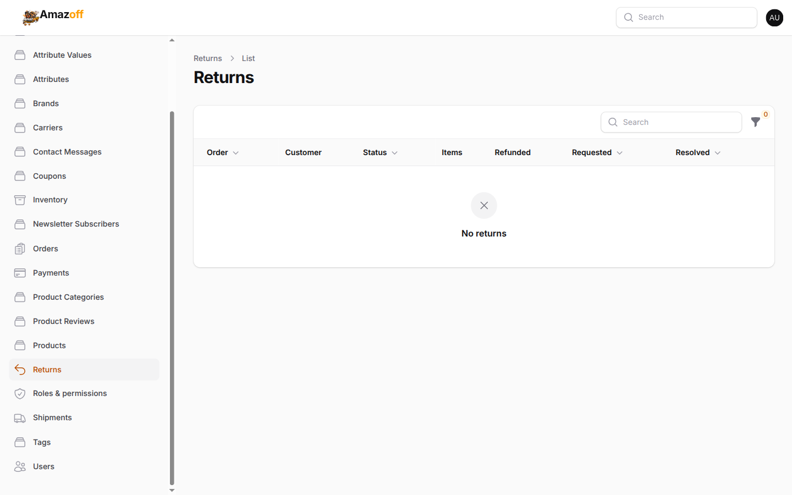

Empty in this seed run — no return requests currently outstanding. When a
request exists, this table gates **Approve**/**Deny**
(`update_return` → `ReviewReturn`) and **Refund**
(`refund_return` → `RefundReturn`) — everything else on the row is read-only.

> **Under the hood:** approving a return and refunding it are two separate
> abilities, not one — a return can be approved without money moving yet,
> and the refund step is what actually calls `RestockReturn` (putting the
> stock back) and, for a card payment, `RefundPayment` (which needs
> `refund_payment` in addition to `refund_return` — refunding a return
> composes into refunding the underlying payment, so both abilities are
> required together). A cash-on-delivery order's refund is marked
> `Refunded` with an offline-cash note instead of a Stripe call, since
> there's no card payment to reverse. No staff role short of administrator
> can reach either action today — giving `warehouse_employee`
> `update_return` would be a deliberate `RoleSeeder` change, not something
> that happens by default.

## Product review moderation

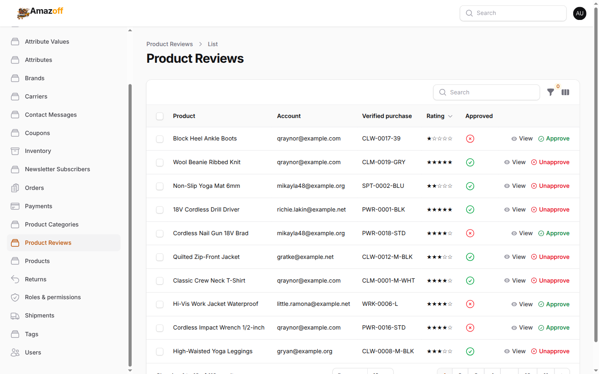

Reviews awaiting or holding approval status, gated by `approve_product_review`
— the same ability used in both directions (approve and unapprove), since
there's no separate "unapprove" permission.

> **Under the hood:** review moderation is deliberately **not** granted to
> `content_editor` even though articles are. The reasoning recorded in
> `docs/reference/permissions.md`: moderating a review means judging spam or
> abuse in a customer's own words, which the spec assigns to administrators
> by name — distinct from authoring or editing content, which is what the
> editor role is actually for.

## Order detail, and the administrator-only cancel/refund path

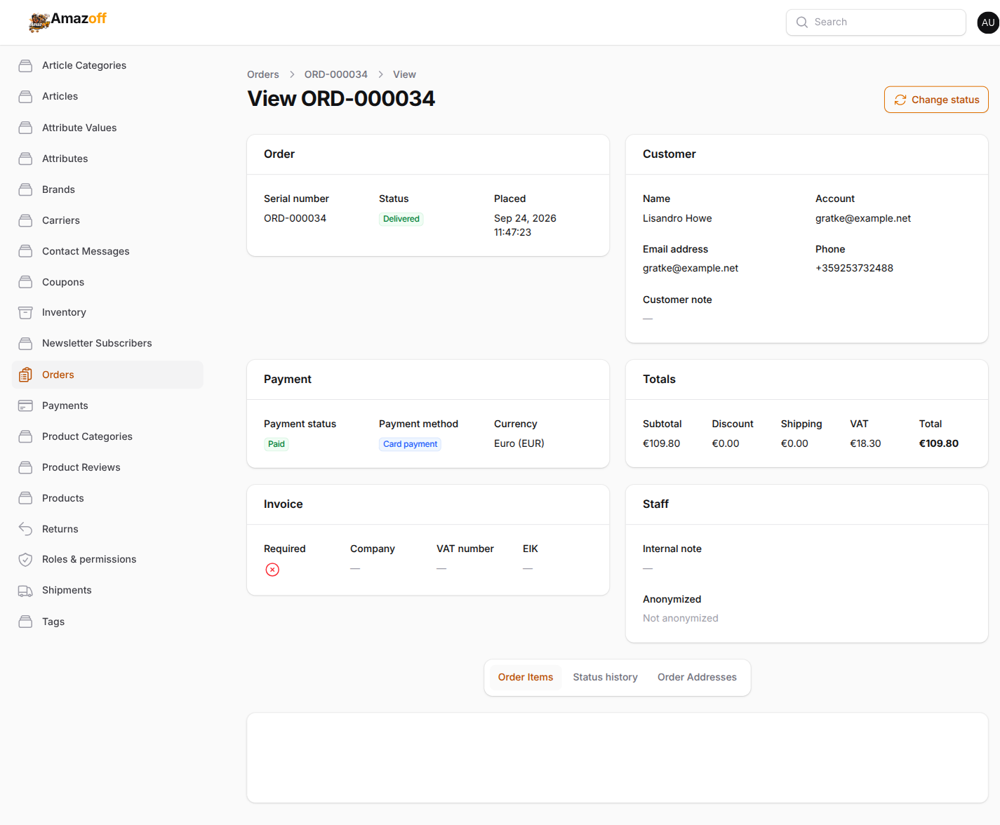

The same order-detail screen shown in the
[warehouse walkthrough](05-admin-warehouse.md), viewed here as the
administrator. Two things are different for this role on the exact same
page: the **Change status** menu additionally offers **Cancel** and
**Refund**, and there is **no Delete button anywhere on this screen or the
orders list** — that's deliberate, not missing functionality.

> **Under the hood:** `OrderPolicy::delete()` hardcodes `false`
> unconditionally, for every role including the administrator (a policy
> denial that *does* hold even against `Gate::before`, because it's coded
> as an explicit `false` rather than left to fall through). §19 of the
> specification requires order history to survive regardless of what
> happens to the order afterward — cancelling, refunding, or returning an
> order all change its `status`, never remove the row. The same reasoning
> is why `create_order` doesn't exist either: an order exists because a
> customer completed checkout, not because staff created one, so there's no
> legitimate reason for a "New order" button to exist in the panel at all.
>
> Cancel and Refund specifically route through `cancel_order`/`refund_order`
> instead of the ordinary `updateStatus_order` ability that drives every
> other status change — ADR-0011 names cancelling and refunding as
> administrator-scoped moves, distinct from a warehouse employee's routine
> forward advance through the fulfilment pipeline. Whichever one is picked,
> the actual write still goes through the same single `TransitionOrderStatus`
> call every other status change uses, so the inventory side effect
> (releasing reserved stock on cancellation) is never something a caller has
> to remember to trigger separately.

## Contact messages

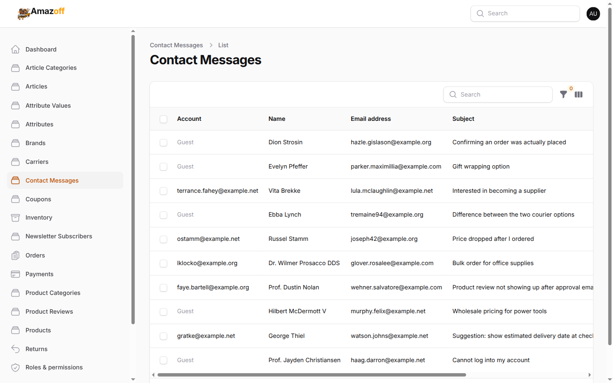

Messages submitted through the storefront's [contact
form](01-storefront-browsing.md). Read-only apart from ordinary CRUD — no
special approval workflow, since a contact message doesn't need one.

## Settings, reports, and the audit log

Three abilities exist in the permission catalogue with no admin resource
behind them yet — `view_report`, `view_audit_log`, `update_setting` — all
named as administrator-only in the specification, checked directly on
whatever page eventually uses them rather than through a policy class. None
currently has a panel screen, so there's nothing to screenshot here; this is
recorded rather than silently skipped.
