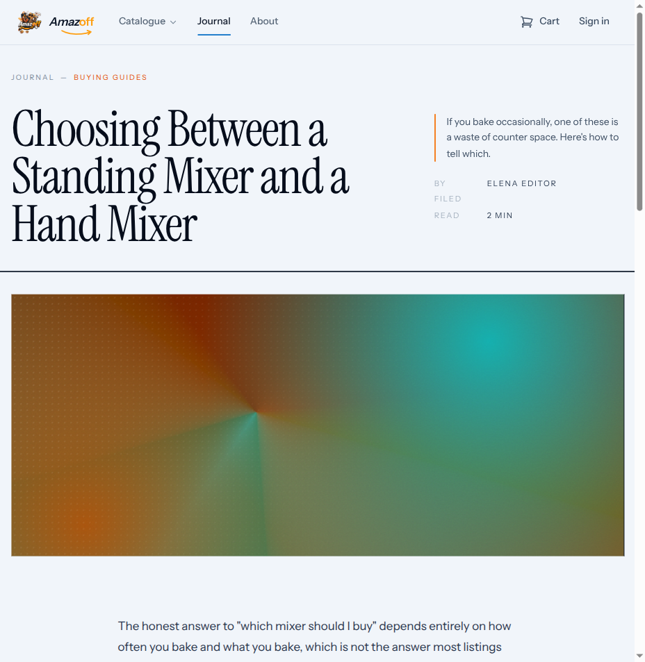
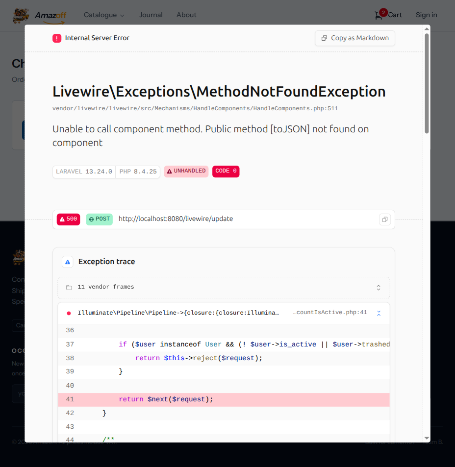

# Security testing — what was probed, what held, what did not

Another page in the family `stripe-testing.md` and `browser-testing.md`
belong to: an honest record of a security pass, including what it could not
reach. `explanation/security-model.md` states the model this checks against;
this page is the result of checking.

**`how-to/pentest-the-system.md` is the procedure that produces this page** —
the tools, the scan commands, the model and effort each phase needs, and the
traps that turn a pass into a false all-clear. Read it before running the
next pass; read this one to see what the last pass found.

A pass here is a claim about the code as read on one date, plus whatever
runtime probing the environment allowed that day. It is not a claim that the
application is secure.

## Method, and its limits

Static review against the whole request path — routes, middleware,
Livewire components, policies, models, raw SQL, and the view layer — with
`CLAUDE.md`'s "Security rules that are ours" as the checklist, since those
are the rules the framework does not enforce on its own.

**Runtime probing was blocked** for most of 2026-09-03 by a host fault
(see `how-to/troubleshooting.md`, "Containers healthy, every request 504").
That fault was repaired on 2026-09-03 (a reboot; see the troubleshooting
entry), and both code findings below were then **confirmed by live
exploitation** against the running app with a real browser driving Livewire
— not merely read from source. The reproduction for each is recorded with
it.

Dependency scanning did complete once the host was repaired.

| Scan | Result |
|---|---|
| `npm audit --omit=dev` | 0 vulnerabilities |
| `composer audit` | **4 advisories, 1 package** — see below |

## Findings

Seven entries. Two are exploitable IDOR/authorization bypasses in this
project's own code, both confirmed by live exploitation on 2026-09-03 and
both since fixed; both share one shape — a client-writable Livewire public
property that a query downstream trusts. The third is a dependency advisory
with no reachable path today. The fourth is an OWASP ZAP baseline scan
confirming the missing-headers gap mechanically and catching one item worth
investigating rather than accepting at face value. The fifth records a
**negative** result — a full active scan finding no injection vulnerability —
because a clean scan is worth nothing unless what it actually covered, and
what it could not see, is written down beside it. Each is written in
bug-bounty report form: **Finding → Reason → Reproduction → Fix → Logic for
future pentests.** The sixth records the headers added to close what the
fifth found still open, including a wildcard the scanner caught in the first
attempt at the fix. The seventh is the first *authenticated* scan — the run
that finally reached the admin panel — and the header gap only it could
find.

Severity uses CVSS-style qualitative bands (Critical / High / Medium / Low /
Info), rated for this application in its current state, not in the abstract.

---

### SEC-001 — Broken access control: any visitor can read unpublished and embargoed articles

**Severity:** High · **Type:** IDOR / broken function-level authorization
(OWASP A01) · **Component:** `app/Livewire/Journal/ArticleDetails.php` ·
**Status:** **Fixed** (confirmed by exploitation, then by regression test)

**Finding.** An unauthenticated visitor can read any article regardless of
its publication state — drafts (`status = draft`), and articles scheduled
for future publication whose embargo date has not arrived. The article
detail page checks visibility only when it first mounts; the property that
selects which article to render is client-controlled and re-read on every
subsequent request, so the check is bypassed by changing that property after
mount.

**Reason (root cause).** `mount()` enforces the gate correctly:

```php
abort_unless(
    Article::query()->visible()->whereKey($article->getKey())->exists(),
    404
);
$this->articleId = $article->getKey();
```

but the computed property that actually feeds the view does not re-apply it:

```php
#[Computed]
public function article(): Article
{
    return Article::query()
        ->with(['author', 'articleCategory', 'tags'])
        ->findOrFail($this->articleId);   // ← no ->visible()
}
```

`public int $articleId` carries no `#[Locked]`. In Livewire 3, every public
property is serialised to the client and re-hydrated from the client payload
on **every** component update — so `$articleId` is attacker-controlled after
the first render. The authorization decision (`->visible()`) and the data
fetch (`findOrFail`) read the same untrusted value at two different times,
and only the first read is guarded. `Article::visible()` gates both
`status = Published` **and** `published_at <= now()`, so the bypass exposes
drafts and embargoed content alike.

**Reproduction.**

1. Seed: `migrate:fresh --seed`, then `DemoSeeder`, `ContentReferenceSeeder`,
   `DemoArticleSeeder` (yields 16 published + 8 non-public articles).
2. Identify a draft id (e.g. 4, `status=draft`) and a scheduled id
   (e.g. 6, `status=scheduled`) via
   `Article::where('status','!=','published')->pluck('status','id')`.
3. As an unauthenticated guest, open a *published* article, e.g.
   `/journal/choosing-the-right-laptop-for-work-and-travel` (id 1).
4. Overwrite the component's `articleId` and force a server round-trip — the
   browser console is the simplest way to emit the crafted Livewire update:

   ```js
   const w = window.Livewire.all()
     .find(c => c.name === 'journal.article-details').$wire;
   w.set('articleId', 4);   // draft
   await w.$refresh();
   ```

5. **Observed:** the URL is unchanged but the rendered `<h1>` and full body
   become the draft's ("Choosing Between a Standing Mixer and a Hand Mixer"),
   including the author byline. Repeating with `articleId = 6` renders the
   embargoed article ("How Much Torque Do You Actually Need in a Power
   Tool").

   

**Fix.** Re-apply the visibility scope wherever the id is *used*, not only
where it is first set — so the guard travels with the value:

```php
#[Computed]
public function article(): Article
{
    return Article::query()
        ->visible()                       // ← the load-bearing change
        ->with(['author', 'articleCategory', 'tags'])
        ->findOrFail($this->articleId);
}
```

Add `#[Locked]` to `$articleId` as defence in depth, but the scope is the
half that must land: it fails safe even if the property is later unlocked or
a second code path sets it. A regression test belongs in
`tests/Feature/Livewire/` asserting that setting `articleId` to a draft's id
and re-rendering 404s (and added to a CI shard in the same change).

**Remediation applied (2026-09-03).** Both mechanisms are now in
`ArticleDetails`: `article()` re-applies `->visible()`, and `$articleId`
carries `#[Locked]`. Proven by
`tests/Feature/Livewire/ArticleDetailsVisibilityTest.php` (5 cases) — the
file sits under a directory already in `.github/workflows/ci.yml`'s shard 2,
so it runs in CI. Each guard was verified by removal: deleting `->visible()`
turns the scope case red (a draft resolves instead of 404ing), deleting
`#[Locked]` turns the tampering case red.

**Logic for future pentests.** This is the **check-at-mount / use-later**
class, specific to any stateful component framework (Livewire, Blazor,
server-driven React) where "the id I validated" and "the id I query" are the
same client-owned field read at two moments. Hunt for it by listing every
`public` property that reaches a query, then checking whether the
authorization predicate is re-evaluated on *every* read of it or only in
`mount()`/constructor. A guard in `mount()` and a bare `findOrFail` in a
`#[Computed]`/render path is the tell. `grep` for `#[Computed]` methods whose
query lacks the scope the mount used.

---

### SEC-002 — IDOR: order serial numbers of other customers are disclosed

**Severity:** Medium · **Type:** IDOR / broken object-level authorization
(OWASP A01) · **Component:** `app/Livewire/Checkout/CheckoutPage.php` ·
**Status:** **Fixed** (confirmed by exploitation, then by regression test)

**Finding.** During checkout, the payment step renders an order's serial
number read from an unscoped `Order::find()` on a client-controlled id. A
visitor can point it at an order they do not own — including another
customer's — and read that order's serial number. Serial numbers are
sequential (`ORD-000001`, `ORD-000002`, …), so this is the enumeration
primitive that `OrderConfirmation` was specifically built to deny, now
reachable on a second path.

**Reason (root cause).**

```php
public ?int $orderId = null;        // client-writable, no #[Locked]
public ?string $clientSecret = null; // client-writable, no #[Locked]

#[Computed]
public function order(): ?Order
{
    return $this->orderId === null ? null : Order::find($this->orderId);
}
```

`Order::find()` is unscoped — no `->where('user_id', ...)`, no session-claim
check — on an id the client controls. The template prints
`{{ $this->order?->serial_number }}` behind an `@elseif ($clientSecret)`
branch, and `$clientSecret` is *also* a client-writable public property, so
one crafted payload both opens the render branch and selects the victim
order. The sibling component `OrderConfirmation` solves this exact problem
correctly (scoped to `auth()->user()->orders()` or a session claim, 404 not
403 to avoid confirming existence); `CheckoutPage` reintroduces the bare
lookup.

**Reproduction.**

1. Seed as above. Place a COD order as guest A (becomes order id 1). Create a
   second order id 2 owned by `customer@example.com` (a different principal).
2. In guest A's session, on `/checkout`, drive the component:

   ```js
   const w = window.Livewire.all()
     .find(c => c.name === 'checkout.checkout-page').$wire;
   w.set('orderId', 2);                                  // not guest A's order
   w.set('clientSecret', 'pi_forged_to_pass_render_gate'); // any truthy string
   await w.$refresh();
   ```

3. **Observed:** the page renders "Order **ORD-000002** is reserved. Enter
   your card to pay." — the serial number of a different customer's order,
   served to a visitor who does not own it.

   

**Why Medium and not High.** Only `serial_number` is printed on this path —
not the address, line items, or totals that make an order-confirmation IDOR
severe. What leaks is the *existence and serial* of an arbitrary order, i.e.
the input to enumeration, not the customer PII itself. It is rated Medium
because the impact is confirmation/enumeration rather than bulk PII
disclosure — but it defeats a control the codebase deliberately built, which
is why it is not Low.

**Fix.** Scope the lookup the way `OrderConfirmation` does, and lock both
properties:

```php
use Livewire\Attributes\Locked;

#[Locked] public ?int $orderId = null;
#[Locked] public ?string $clientSecret = null;

#[Computed]
public function order(): ?Order
{
    if ($this->orderId === null) {
        return null;
    }
    $user = auth()->user();
    if ($user && ($owned = $user->orders()->find($this->orderId))) {
        return $owned;
    }
    return session(OrderConfirmation::SESSION_KEY) === $this->orderId
        ? Order::find($this->orderId)
        : null;
}
```

`#[Locked]` alone would blunt the console reproduction, but the scoped query
is what makes the id safe even if it arrives some other way — the same
reasoning `OrderConfirmation` documents.

**Remediation applied (2026-09-03).** `order()` now scopes to
owner-or-session-claim, and both `$orderId` and `$clientSecret` carry
`#[Locked]`. Proven by four cases added to
`tests/Feature/Payment/CheckoutTest.php` (already in CI shard 2): the
disclosure case (a guest cannot read a foreign order's serial), the lock
case (tampering with either property throws), and two that confirm the
legitimate owner and just-placed-guest paths still resolve. Verified by
removal: reverting `order()` to the bare `Order::find()` turns the
disclosure case red. The full 26-case checkout suite still passes, so the
fix does not regress guest or registered checkout.

**Logic for future pentests.** Same **object-level authorization on a
client-owned id** class as SEC-001, but the tell here is a *second, unhardened
copy* of a query the codebase already secured elsewhere. When one component
(here `OrderConfirmation`) is conspicuously careful about an IDOR, grep for
every other component that loads the *same model by id*
(`grep -rn 'Order::find' app/Livewire`) and check each independently — a
control applied on one path is routinely missing on a sibling path. Also
note the double-gate bypass: when a render branch is guarded by another
public property (`$clientSecret`), that guard is only as strong as that
property is locked; a client-writable flag protecting a client-writable id
protects nothing.

---

### SEC-003 — Vulnerable dependency: `league/commonmark` 2.9.0 (no reachable path)

**Severity:** Low (Informational for this app today) · **Type:** Vulnerable
& outdated component (OWASP A06) · **Status:** Reported by `composer audit`,
exposure verified nil

**Finding.** `composer audit` reports four advisories against
`league/commonmark` 2.9.0, two rated **high** by the advisory database: an
XSS filter bypass in `AttributesExtension`'s `on*` event-handler filter via a
U+000C form feed (`GHSA-f8fg-pg57-v4j8`), and a DoS via crafted code fences,
reference links, and emphasis delimiters (`GHSA-j8pm-gj4c-rq4x`). All four are
fixed in **2.9.1**, a patch release.

**Reason (root cause / reachability).** The package is transitive — pulled by
`laravel/framework` and `laravel-lang/publisher`, named nowhere in
`composer.json`. Every advisory requires attacker-controlled **Markdown**
reaching the CommonMark parser, and this application renders no Markdown
anywhere: `grep -rniE 'commonmark|Str::markdown|@markdown'` over `app/` and
`resources/views/` is empty, and there are no Markdown mailables or
notifications. So the vulnerable code is installed but not on any request
path. Exposure today is a property of what the app does not do yet, not of a
boundary that enforces anything.

**Reproduction.** `docker compose exec app composer audit` — reports "4
security vulnerability advisories affecting 1 package." There is no
application-level reproduction because no route reaches the parser.

**Fix.**

```bash
composer update league/commonmark --with-dependencies
```

Bumps to ≥ 2.9.1. Low-risk (patch release); do it on the next dependency
pass.

**Logic for future pentests.** A transitive dependency advisory is only as
real as its reachability — rate it by whether a request path feeds the
vulnerable function, not by the advisory's headline CVSS. Re-check this one
specifically the moment any Markdown-rendered field ships (a product
description, an article body edited as Markdown, a review): the first such
field turns a nil-exposure advisory into a live stored-XSS on day one, so
"unreachable today" is a note to revisit, not a dismissal. Standing rule:
re-run `composer audit` every dependency change and every pentest pass, and
diff the reachable set, not just the advisory count.

---

### SEC-004 — Automated scan: missing security headers (OWASP ZAP baseline)

**Severity:** Low (Informational — no header here enables an attack on its
own; each raises the cost of one if another bug provides the entry point) ·
**Type:** Security misconfiguration (OWASP A05) · **Component:** nginx
response headers, storefront · **Status:** **Fixed in dev/app code; the
Forge equivalent is still owed** (see Remediation applied)

**Finding.** `zap-baseline.py` (OWASP ZAP, stable, Docker) run against
`/` and `/catalogue`: **0 FAIL, 12 WARN, 55 PASS.** This is the automated
scan the report's first pass named as owed — it closes that gap and
confirms mechanically what static reading had already found by hand
(the "Hardening gaps" section below), plus surfaces two headers not
named individually before.

| ZAP rule | What it means here |
|---|---|
| CSP Header Not Set [10038] | No Content-Security-Policy. Already reported below |
| Missing Anti-clickjacking Header [10020] | No `X-Frame-Options` / `frame-ancestors` |
| X-Content-Type-Options Header Missing [10021] | No MIME-sniffing protection |
| Permissions Policy Header Not Set [10063] | No `Permissions-Policy` |
| Cross-Origin-Embedder-Policy Header Missing [90004] | No COEP (low relevance without cross-origin isolation in use) |
| Server Leaks Version Information [10036] | nginx's `Server` header discloses its version |
| Server Leaks Information via X-Powered-By [10037] | PHP-FPM's `X-Powered-By` discloses the PHP version |
| Cookie No HttpOnly Flag [10010] | See below — investigated, not a bug |
| Cross-Domain JS Source File Inclusion [10017], Sub Resource Integrity Missing [90003] | External `<script>` tags (fonts/CDN, if any) without SRI hashes |
| Non-Storable Content [10049], Session Management Response Identified [10112] | Informational — cache-control shape and session-cookie detection, not findings |

**Reason.** No security-header middleware exists anywhere in the app
(`grep -rn 'add_header' docker/nginx/*.conf` returns nothing), and nginx
and PHP-FPM both leak version banners by default. This is the same
absence the "Hardening gaps" section already named from reading the
config; the scan is the mechanical confirmation, run against the live
response rather than inferred from the file.

**One item investigated rather than accepted at face value: "Cookie No
HttpOnly Flag."** `curl -I` against the live app shows two cookies:

```
Set-Cookie: XSRF-TOKEN=...; samesite=lax                     ← no HttpOnly
Set-Cookie: amazoff-session=...; httponly; samesite=lax       ← HttpOnly set
```

The session cookie — the one that matters — correctly carries `HttpOnly`.
`XSRF-TOKEN` does not, and **that is by design, not a bug**: Laravel's CSRF
double-submit pattern requires the frontend's JavaScript to read this
cookie and echo it back as the `X-XSRF-TOKEN` header, which is what makes
Axios's automatic CSRF handling work. A `HttpOnly` XSRF-TOKEN would break
CSRF protection outright, not improve it. **ZAP's rule flags every cookie
without the flag regardless of purpose — it does not know this pattern.**
This is a false positive, recorded rather than silently dropped, since the
alternative (skipping ZAP's warnings without checking each) is exactly the
kind of unverified pass this project's own testing standard rejects.

**Reproduction.**

```bash
docker run --rm --network online_shop_teamb_default \
  ghcr.io/zaproxy/zaproxy:stable \
  zap-baseline.py -t http://webserver:80/catalogue
```

Run from the host against the Docker network's internal service name
(`webserver:80`), not `localhost:8080` — the published port is a host-side
mapping ZAP's container does not share.

**Fix.** One `Illuminate\Http\Middleware` (or nginx `add_header` block)
setting `X-Frame-Options: DENY`, `X-Content-Type-Options: nosniff`,
`Referrer-Policy: strict-origin-when-cross-origin`, and a
`Permissions-Policy`. Suppress the two version-disclosure headers —
`server_tokens off;` in nginx, `expose_php = Off` in `php.ini` for
PHP-FPM. CSP needs actual design (Livewire's inline `wire:` attributes
and Alpine's `x-data` need `unsafe-inline` or nonces worked out
deliberately) rather than a pasted default, so it is scoped separately
from the other four, which are safe to add as a single small change.

**Remediation applied (2026-09-03) — the app half.**
`App\Http\Middleware\SetSecurityHeaders` sets the four headers, registered
**globally** (`$middleware->append()`, not `$middleware->web()`) — a
`web`-scoped middleware would leave `/admin` unheadered, since
`AdminPanelProvider` builds its own middleware stack and does not inherit
`web`. Verified against the running app with `curl -I` on both
`/catalogue` and `/admin` before writing the test, and proven by
`tests/Feature/Support/SecurityHeadersTest.php` (3 cases): scoping the
middleware to `web()` instead of appending it globally turns the
admin-panel case red, confirming the global registration is load-bearing,
not incidental.

**The version-disclosure half is dev-only, not production.** `server_tokens
off` in `docker/nginx/default.conf` and `expose_php = Off` in a new
`docker/php/conf.d/security.ini` suppress `Server` and `X-Powered-By`
locally — confirmed with `curl -I`, both headers gone. **Neither reaches
production**: this repo's Docker Compose stack is dev/CI only, and
production runs on Forge, which provisions nginx and PHP-FPM directly on
the VPS (ADR-0001) — a container config change here has no effect there.
Forge's own nginx and `php.ini` need the same two directives set
independently; recorded here rather than closed.

**No CSP added.** Still open, deliberately, per the Fix note above.

**Logic for future pentests.** An automated scanner's header/config
category is cheap to run and safe to trust *for what it directly
observes* (a header is present or it is not) — but its interpretation of
*why* still needs a human, as the XSRF-TOKEN case shows. Re-run
`zap-baseline.py` after any nginx or middleware change touching headers,
and specifically after CSP is added — ZAP will confirm whether the policy
is present, not whether it is correctly scoped for Livewire/Alpine.

---

### SEC-005 — Full active scan (OWASP ZAP): no injection vulnerability found

**Severity:** n/a — this records a *negative* result · **Status:** Complete,
2026-09-03

Recorded because a clean scan is only worth anything if what it actually
covered is written down. `zap-full-scan.py` — the baseline's passive rules
**plus** active attack payloads fired at every discovered parameter — run
against `/catalogue` after the SEC-004 header fix was deployed.

**Result: 136 rules, 0 FAIL, 5 WARN.** Every injection class passed *under
active attack*, not merely by inspection:

| Attack class | Rules passed |
|---|---|
| SQL injection | 7 — generic, plus time-based blind for MySQL, PostgreSQL, Oracle, MsSQL, Hypersonic |
| Cross-site scripting | 5 — reflected, persistent (3 variants), DOM-based |
| Path traversal / RFI | 2 |
| OS command injection | 2 — direct and time-based |
| Server-side template injection | 2 — direct and blind |
| XXE, XSLT, XPath, LDAP, SSI, NoSQL | 6 |

This is independent confirmation of the static review's conclusions rather
than new information: the review had already established that every query
binds its parameters, that `ORDER BY` sits behind an `array_key_exists`
allow-list (`ProductList::safeSortBy()`), and that the view layer contains
zero `{!! !!}`. ZAP attacked those paths and agreed. **Two methods, same
answer, is worth more than either alone** — and neither found the other's
bugs, which is the point made at the top of `how-to/pentest-the-system.md`.

**The header fix is confirmed mechanically.** Three rules that the baseline
scan failed now pass: `X-Content-Type-Options Header Missing [10021]`,
`Server Leaks Information via "X-Powered-By" [10037]`, and `Permissions
Policy Header Not Set [10063]`. Baseline reported 12 warnings; this run
reports 5. That is the fix-then-rescan loop closing, rather than a claim
that the config file was edited.

**The 5 remaining warnings, each triaged rather than transcribed:**

| Warning | Assessment |
|---|---|
| `Cookie No HttpOnly Flag [10010]` | **False positive**, same as the baseline — it flags `XSRF-TOKEN`, which must be JS-readable for Laravel's CSRF double-submit. The session cookie does carry `HttpOnly`. See SEC-004 |
| `Cross-Domain JavaScript Source File Inclusion [10017]` | **Dev-environment artifact.** The flagged scripts are `http://localhost:5173/@vite/client` and `.../app.js` — the Vite dev server. Production serves bundled, same-origin assets from `npm run build`; no dev server exists there |
| `Sub Resource Integrity Attribute Missing [90003]` | **Same cause.** SRI hashes are for third-party CDN assets; these are the local Vite dev server. Not applicable to the built production bundle |
| `CSP Header Not Set [10038]` | **Real, and knowingly open.** SEC-004 scopes CSP out as separate work needing deliberate design for Livewire/Alpine |
| `Cross-Origin-Resource-Policy Missing [90004]` | **Real, low.** CORP matters when a page opts into cross-origin isolation; nothing here does. Worth adding with the CSP work, not before |

So: **one genuinely open item (CSP), two false positives, two dev-only
artifacts.** Nothing actionable was found that was not already known.

**What this scan did *not* cover, and it is the important half.** The scan
began from an unauthenticated spider, so **everything behind login was
invisible to it** — the entire Filament admin panel, the account pages, and
every authenticated flow. Its 0-FAIL result is a statement about the public
storefront only. An authenticated scan requires giving ZAP a session
(context plus a logged-in user), which was not done; **the admin panel's
automated coverage remains zero.**

The scan also spent most of its runtime on low-value work: it probed each of
the 182 demo product images for `.bak`, `.backup`, `.zip` and similar
variants — thousands of requests returning 404, at ~77 requests/second — and
took **over an hour** as a result. `how-to/pentest-the-system.md` records the
timing and how to scope this down; excluding `/storage/*` would cut the
runtime dramatically without losing coverage that matters.

**One operational note.** The run finished its scanning successfully and
then exited **3** on `Permission denied: /zap/wrk/zap-full-report.html` —
the mounted output directory was owned by `root` from an earlier run, and
ZAP runs as the `zap` user. The findings survived in the container's stdout;
the HTML/XML reports were lost. Fix by ensuring the output directory is
writable by uid 1000 before the run. A non-zero exit from this tool means
"findings at or above the threshold, **or** a reporting failure" — check
which before concluding the scan failed.

---

### SEC-006 — Missing CSP and CORP, and a wildcard in the first attempt at one

**Severity:** Low (defence in depth — neither header stops an attack alone;
both raise the cost of one another bug provides the entry point) ·
**Type:** Security misconfiguration (OWASP A05) · **Component:**
`app/Http/Middleware/SetSecurityHeaders.php` · **Status:** **Fixed**

**Finding.** SEC-005 left two warnings genuinely open after the false
positives and dev-only artifacts were separated out: no
`Content-Security-Policy` and no `Cross-Origin-Resource-Policy`. A third
appeared only *after* the first fix attempt, and is recorded here because
the way it was caught is the point.

**Reason.** No middleware set either header. CSP had been deliberately
scoped out of SEC-004 as needing design rather than a pasted default, which
was the right call — and the design question turned out to have a measured
answer rather than a matter of taste.

**This stack cannot run a strict CSP**, and that is a fact about the
frontend, not a preference:

- Alpine evaluates its attribute expressions (`x-data="{ open: false }"`,
  `x-on:click="…"`) at runtime through the equivalent of `eval`, so it
  requires **`unsafe-eval`**. Verified in a browser: Alpine components
  initialise only when it is permitted.
- The rendered catalogue carries inline `<script>` and `<style>` blocks and
  **176 inline `style="…"` attributes**, so it requires **`unsafe-inline`**.

A policy forbidding those does not harden the application, it stops it
working. So the policy buys what it still can, and those directives are not
nothing:

| Directive | What it stops even with a permissive `script-src` |
|---|---|
| `frame-ancestors 'none'` | Clickjacking — and unlike `X-Frame-Options`, this is the standard modern browsers actually honour |
| `object-src 'none'` | Plugin/object embedding |
| `base-uri 'self'` | An injected `<base>` silently rewriting every relative URL on the page |
| `form-action 'self'` | An injected form posting credentials to another origin |

**Two mistakes in the first attempt, both caught by checking rather than by
reading the header.** They are recorded because each is a general lesson:

1. **`font-src 'self' data:` blocked 12 font loads.** Instrument Sans *is*
   bundled through Vite rather than fetched from a CDN — but in development
   Vite serves the `.woff2` files from `localhost:5173`, so they are
   cross-origin locally. Those requests originate in CSS, so the
   `curl | grep 'https://'` over the HTML that "confirmed" no external fonts
   never saw them. The page fell back to a system face; nothing errored
   server-side. **A header is not verified until a browser has rendered the
   page under it.**
2. **`img-src 'self' data: blob: https:` carried an unjustified wildcard.**
   The `https:` was added speculatively for "an admin pasting a remote image
   URL" — a case that does not exist here: every image is same-origin,
   product photos from `/storage` and the logo from `/images`, verified
   against both the storefront and the panel. The **authenticated scan's own
   passive rules flagged it** (`CSP: Wildcard Directive`, Medium) and were
   right to: `https:` would let an injected `` beacon to any host on the
   internet, which is most of what an `img-src` restriction exists to
   prevent.

The second is the more instructive: a speculative permission, added "just in
case", is how a policy quietly becomes decorative.

**Fix.** `SetSecurityHeaders` now sets a CSP with the four load-bearing
directives above, `img-src 'self' data: blob:` with no wildcard, and
`Cross-Origin-Resource-Policy: same-site`. Vite's dev-server origin is
permitted in `script-src`, `style-src`, `font-src` and `connect-src`
**outside production only**, via `app()->isProduction()` — a production
build emits same-origin bundles and must not permit it.

**Verified in a browser, not by reading the header** — the discipline the
first attempt failed:

- storefront back to its 4 pre-existing Vite CORS errors, **zero CSP
  violations**
- Alpine components initialising (so `unsafe-eval` is correctly permitted)
- a **Livewire round-trip succeeding** (so `connect-src` is right)
- 14 of 14 catalogue images loading, none broken
- the Filament panel rendering 9 stylesheets, 50 widgets, 41 sidebar links,
  and **zero console errors**

Pinned by a fourth case in `tests/Feature/Support/SecurityHeadersTest.php`
asserting the four directives that must survive any future loosening of
`script-src`.

**Logic for future pentests.** Two rules come out of this. **A CSP written
for a framework you have not measured will either break the app or be
decorative** — check what the framework actually needs (`grep` for
`x-data`/`wire:`, count inline `style=` attributes) before choosing
directives. And **every source in a policy needs a reason you can name**;
`https:`, `*`, or a host added "in case" is a permission granted to an
attacker as much as to the application. Re-run the scan after any CSP
change: its passive rules grade the policy itself, which is the one part of
this a scanner does better than a human.

---

### SEC-007 — Authenticated scan: static assets carried no security headers

**Severity:** Low · **Type:** Security misconfiguration (OWASP A05) ·
**Component:** `docker/nginx/default.conf` · **Status:** **Fixed** (dev);
Forge equivalent owed

**Finding.** The first *authenticated* scan — 376 endpoints, 20m33s of
active scanning against the admin panel — found that every static asset
served by nginx goes out with **no security headers at all**. Filament's own
`/css/filament/…`, `/js/filament/…` and `/fonts/…` files, plus everything
under `/images/` and `/storage/`, were missing even `X-Content-Type-Options`.

**Reason.** `nginx` serves static files straight from disk via
`try_files $uri`, so the request never reaches PHP and
`App\Http\Middleware\SetSecurityHeaders` never runs. The middleware
covers every page nginx *hands to PHP* and nothing else — a boundary that
was invisible until something crawled the asset URLs.

**Why both earlier scans missed it.** The baseline (SEC-004) and the
unauthenticated full scan (SEC-005) start from a guest spider, which never
reaches Filament's asset paths because it never reaches Filament. This is
the concrete demonstration of the gap those entries flagged in the
abstract: **an unauthenticated scan does not merely miss authenticated
*pages*, it misses whole classes of infrastructure behaviour** that only
appear once a crawl gets that far.

**Fix.** `add_header X-Content-Type-Options "nosniff" always;` in the
`server` block. Only `nosniff` — `X-Frame-Options` and CSP govern documents
rather than stylesheets, and the middleware already covers documents.
`always` is required: without it nginx omits the header on non-2xx
responses, which is exactly where sniffing is most dangerous.

Verified on a Filament stylesheet and on `/images/logo.png`. **One trap
worth recording:** the first verification appeared to fail — `curl -I`
showed no header after a `docker compose restart webserver`. The config was
correct and `nginx -t` passed; `curl` had reused a keep-alive connection
opened *before* the restart. `-H "Connection: close"` showed the header
immediately. A header check against a just-restarted server needs a fresh
connection, or it tests the old configuration.

Dev-only, like the rest of the nginx hardening here: Forge provisions its
own nginx (ADR-0001), so this directive is owed there independently.

### What the authenticated scan proved, and what it did not

The run itself is worth recording beyond the one finding.

**Scope reached:** 759 URLs from the traditional spider plus 130 more from
the AJAX spider, 376 endpoints scanned, against the previous run's **3**.

**Result: 0 High, 5 Medium, 5 Low.** No injection alert of any kind —
no SQL injection, XSS, path traversal, or template injection — now
including the admin panel, which had never been scanned before.

The 5 Medium are all known and previously assessed: three are the
`unsafe-eval`/`unsafe-inline` CSP trade-off SEC-006 measured and documented,
one is `Sub Resource Integrity` against the Vite dev server, and one is
`HTTP Only Site` — correct for local development, and the reason
`SESSION_SECURE_COOKIE` and HTTPS enforcement are on the pre-deploy
checklist in `how-to/pentest-the-system.md`. **The `CSP: Wildcard Directive`
alert from the previous run is gone**, confirming SEC-006's `img-src` fix.

**Two results that are evidence of the app working, not of bugs:**

- **120 "Big Redirect" alerts**, every one an `/admin/*` URL returning
  `302 → /login`. That is authorization refusing an unauthenticated request,
  which is what it should do.
- **230 responses of `403`**, almost all directory-traversal probes against
  `/images/`, `/storage/` and `/js/` — nginx's `deny all` refusing directory
  access.

**The coverage caveat, stated precisely rather than rounded up.** Those 120
redirects are also the limit of this run: **the session expired partway
through the 20-minute active scan.** Counted from nginx's own logs, the scan
reached **44 distinct admin paths authenticated (HTTP 200)** while 4,550
requests were redirected to login after the session lapsed. So admin-panel
coverage went from *zero* to *partial* — real, and materially better, but
not the whole panel. A longer-lived session (or ZAP re-authenticating on a
logged-out response, via a context authentication method with a
`loggedOutRegex`) is what would close the rest, and is the obvious next
improvement.

**One informational alert is a false positive:** "Sensitive Information in
URL" fires on `/login?email=zaproxy%40example.com&password=ZAP` — ZAP's own
fuzzer URL, not a request the application ever generates.

### The re-run, after the fixes

A second authenticated run with `threadPerHost: 2` (the session fix above)
and SEC-007's nginx header in place: **376 endpoints, 0 High, 4 Medium, 4
Low.** Three alerts cleared, each confirming a specific fix rather than
merely vanishing — `X-Content-Type-Options Header Missing` (SEC-007's nginx
`add_header`), `CSP: Wildcard Directive` (SEC-006's `img-src`), and
`Big Redirect` falling from **120 instances to 3** (the session fix; the
remaining 3 are unauthenticated probes that *should* redirect).

One informational alert was investigated rather than dismissed: `User
Controllable HTML Element Attribute (Potential XSS)` on
`/catalogue?category=garden`. ZAP's own wording is "try injecting special
characters to see if XSS might be possible" — a hint, not a finding. Tested
by hand: `?category="><script>alert(1)</script>` is not reflected at all,
and `?category=ZZQUOTE"ZZ` renders as `ZZQUOTE\&quot;ZZ` — HTML-escaped
*and* backslash-escaped inside the Livewire JSON payload. Blade's `{{ }}`
escaping holds, there is no attribute breakout. **Confirmed false
positive.**

---

### The pattern behind SEC-001 and SEC-002 — `#[Locked]` is absent project-wide

`grep -rn '#\[Locked\]' app/` returns **zero** results. Both exploitable
findings are instances of one missing habit rather than two unrelated slips:

> **Any public Livewire property that holds an identifier, or feeds an
> authorization decision, needs `#[Locked]` *and* a re-check at the point of
> use.**

`OrderConfirmation` already demonstrates the re-check form and documents why
its lookup is scoped and re-evaluated on every render; that reasoning simply
was not carried to `ArticleDetails` or `CheckoutPage`. Fixing the two
findings closes the live holes; adopting the rule above closes the class.

Four other ID-bearing public properties were checked and are **not**
findings today — `ProductDetails::$productId` and `$imageIndex`,
`CartPage::$quantities` and `$couponCode` — because each reaches only public
catalogue data or a validated cart write. They are the same shape, though: a
future non-public column on `products`, or any authorization tied to a cart,
would promote them to findings, so they belong on the watch-list for the next
pass.

---

### SEC-008 — Latent privilege escalation: a role granted `update_role` can grant itself everything

**Severity:** Low–Medium (latent — requires an administrator to open it
first; not exploitable on `main` today) · **Type:** Privilege escalation /
broken function-level authorization

**Status:** **Fixed** 2026-09-05 — confirmed by live exploitation before and
after

**Finding.** `role` is a resource in `PermissionCatalogue::CRUD_RESOURCES`
(under the *Administration* group), so `update_role` and `viewAny_role`
render as ordinary tickable checkboxes on the Roles & permissions form,
presented no differently from `update_brand`. An administrator who ticks
them for `content_editor` or `warehouse_employee` has granted that role the
ability to edit **its own** permission set, and from there to grant itself
every other permission in the catalogue — including `assignRole_user`, the
ability the `UserResource` work was specifically built to fence off.

**Reason (root cause).** `RolePolicy::update()` is a flat permission check
with no relationship between the actor and the role being edited:

```php
public function update(User $user, Role $role): bool
{
    return $user->can('update_role');
}
```

The policy's own docblock names the danger exactly — *"This is the
permission that lets someone change what any role may do, including their
own. It is the most powerful ability in the catalogue"* — but nothing in
the code acts on the "including their own" half.

This is the same bug class `UserPolicy` already solved once. There, granting
a role was split out of `update_user` into `assignRole_user`, and the
self-edit refusal was placed in `EditUser::mutateFormDataBeforeSave()`
rather than the policy, because `Gate::before` short-circuits every check
for an administrator and a policy-level guard would be dead code.
`RoleResource` never received the equivalent guard, so the escalation path
that was closed on users remains open on roles.

**Reproduction.** Run against the seeded stack, inside a rolled-back
transaction so it leaves no trace:

```
docker compose exec -T app php artisan tinker --execute="
DB::beginTransaction();
\$editor = App\Models\User::where('email','editor@example.com')->first();
\$role = Spatie\Permission\Models\Role::where('name','content_editor')->first();
\$role->givePermissionTo('update_role','viewAny_role');
app(Spatie\Permission\PermissionRegistrar::class)->forgetCachedPermissions();
echo 'can update RolePolicy: '.var_export(\$editor->fresh()->can('update', \$role), true).PHP_EOL;
\$role->givePermissionTo('delete_user');
app(Spatie\Permission\PermissionRegistrar::class)->forgetCachedPermissions();
echo 'editor now holds delete_user: '.var_export(\$editor->fresh()->can('delete_user'), true).PHP_EOL;
DB::rollBack();"
```

Output:

```
can update RolePolicy: true
editor now holds delete_user: true
```

`delete_user` is a permission `content_editor` is denied by §3.3 by name,
reached in one step from the granted ability.

**Not exploitable today**, verified on the same stack: no role holds
`update_role` (`Permission::where('name','update_role')->first()->roles` is
empty), and `RolePermissionTest` already pins
`$editor->can('viewAny_role')` as false. The escalation requires an
administrator to tick the box first.

**Fix (applied 2026-09-05).** `EditRole` refuses editing a role the actor
themselves holds, and does so in **`beforeValidate()`** — not in
`RolePolicy`, and not in `mutateFormDataBeforeSave()`.

Not the policy, for the `Gate::before` reason `EditUser`'s docblock already
records: the short-circuit makes a policy-level self-check dead code for the
one role that can reach this page.

**Not the mutate hook, and this is the part worth recording.** The obvious
placement fails silently. The permission checkboxes are `relationship()`
fields, and Filament saves those inside `$this->form->getState()`
(`filament/schemas/src/Concerns/HasState.php` — `saveRelationships()`),
which runs *before* `mutateFormDataBeforeSave`. A `Halt` thrown from the
mutate hook is too late: the pivot rows are already written and the
escalation has happened.

That was not reasoned out — it was measured. The guard was placed in the
mutate hook first; a probe showed the permission count still going 0 → 1,
and throwing a distinctive exception from the hook proved it *was* running.
`beforeValidate()` is the first hook `EditRecord::save()` calls, before any
state is read, and is the only one that can stop this.

Verified with a control, because a guard that refuses everything looks
identical to a guard that works:

```
A own role   : 0 -> 0    REFUSED (correct)
B other role : 16 -> 11  SAVED (control correct, §3.5 intact)
```

§3.5 is untouched — an administrator still edits every role they do not hold,
at runtime, without a deploy.

**Logic for future pentests.** The pattern is **a permission whose subject
is the permission system itself**. Ordinary abilities are safe to expose as
checkboxes because their blast radius is one resource; `update_role` is
reflexive — its blast radius is the catalogue, because the thing it edits is
the thing that decides everything else. Any future ability with that
property (a permission over permissions, a role over roles, a setting that
controls authorization) needs a self-reference guard at a seam
`Gate::before` cannot bypass, and it needs it at the moment the ability is
added to the catalogue rather than when a resource for it is built. The
generalisation of SEC-001's check-at-mount/use-later rule: here the check is
not merely late, it is absent for the one actor who can reach it.

---

### SEC-009 — The CSP blocks the payment form it was written to protect

**Severity:** High (availability — card checkout cannot complete) ·
**Type:** Security misconfiguration (OWASP A05)

**Status:** **Fixed** 2026-09-05 — confirmed live before and after

**Finding.** `SetSecurityHeaders` emits a `Content-Security-Policy` that
names no Stripe origin anywhere. The checkout's payment step loads
`https://js.stripe.com/v3/` (`checkout-page.blade.php`, inside an `@assets`
block), and the browser refuses it. Card payment cannot be completed by any
customer.

Three separate directives each break it independently, so fixing one is not
enough:

| Directive | Current value | Effect |
|---|---|---|
| `script-src` | `'self' 'unsafe-inline' 'unsafe-eval' http://localhost:5173` | **Blocks Stripe.js from loading at all** |
| `connect-src` | `'self' http://localhost:5173 ws://localhost:5173` | Blocks Stripe.js's own XHR to `api.stripe.com` |
| *(no `frame-src`)* | falls back to `default-src 'self'` | Blocks the 3-D Secure challenge iframe |

`Permissions-Policy: payment=()` additionally disables the Payment Request
API, which is what powers the Apple Pay / Google Pay buttons the Payment
Element renders.

**Reason (root cause).** The CSP was introduced by SEC-006 to close a ZAP
finding, and its own docblock reasons carefully about `frame-ancestors`,
`object-src`, `base-uri` and `form-action` — the four directives that hold
regardless of a permissive `script-src`. Stripe was never added because the
policy was written and verified against the *catalogue*, and the payment
step is the one page in the application that loads a third-party script.

The production branch is **stricter**, not looser — it drops the Vite dev
host and still names no Stripe origin — so this breaks production at least
as badly as local.

**Why no test caught it.** Every payment test fakes `StripeClient`, which
lives server-side; the CSP is a *response header* the *browser* enforces.
Neither half of the suite can observe the other. The header test pins the
four directives SEC-006 chose to enforce and does not assert that any
particular script is loadable.

**Reproduction.** Against the running stack, from any storefront page:

```js
// In the browser console, or via a driver:
const s = document.createElement('script');
s.src = 'https://js.stripe.com/v3/';
s.onerror = () => console.log('blocked');
document.head.appendChild(s);
```

Console output, verbatim:

```
Loading the script 'https://js.stripe.com/v3/' violates the following
Content Security Policy directive: "script-src 'self' 'unsafe-inline'
'unsafe-eval' http://localhost:5173". Note that 'script-src-elem' was not
explicitly set, so 'script-src' is used as a fallback. The action has been
blocked.
```

`typeof window.Stripe` stays `undefined`. A `fetch()` to
`https://api.stripe.com/v1/tokens` fails with `TypeError: Failed to fetch`,
which is `connect-src` refusing it.

That the checkout really does load this script was confirmed separately: an
order driven to the payment step renders `stripe-payment-element`, and
`checkout-page.blade.php:39` is the `<script src="https://js.stripe.com/v3/">`
that the CSP then blocks.

**Fix (applied 2026-09-05).** Stripe documents the exact origins its
integration needs. The narrow form, added to the existing builder rather
than widening it:

- `script-src` … `https://js.stripe.com`
- `connect-src` … `https://api.stripe.com`
- `frame-src https://js.stripe.com https://hooks.stripe.com` — a *new*
  directive; without it `default-src 'self'` blocks the 3DS challenge
- `Permissions-Policy: payment=(self "https://js.stripe.com")` rather than
  `payment=()`

Named origins, no wildcards — the same discipline SEC-006/SEC-007 already
applied when refusing a blanket `https:` for `img-src`. `frame-ancestors`
stays `'none'`: `frame-src` governs who *we* may embed and is unrelated,
which is worth stating because widening one and loosening the other by
accident is the obvious way to get this wrong.

**Verified end to end in a browser after the fix**: Stripe.js loads,
`window.Stripe` is a function, `api.stripe.com` is reachable, the Payment
Element renders its card fields, and a `4242…` test card completed a real
payment — order `ORD-000011`, `redirect_status=succeeded`, and the webhook
moved the payment to `paid`.

**The regression test needed its own correction**, recorded because it is the
same class of mistake as the finding. The first version asserted
`toContain('script-src')` and `toContain('https://js.stripe.com')` as
*separate* expectations, which passes even when `script-src` has lost the
origin — because `frame-src` still mentions it elsewhere in the same header.
Caught by emptying the constant and watching the test stay green. It now
parses the header per directive and asserts which directive carries which
origin; emptying either constant turns it red.

**Logic for future pentests.** The pattern is **a policy verified against
the wrong page**. A CSP is per-response and global, but it was written while
looking at the catalogue — the one part of the site that loads nothing
third-party. The general rule: **enumerate every external origin the
application actually loads, then check the policy against that list**, not
against the page you happen to have open. `grep -rn 'https://' resources/views`
takes seconds and would have caught this.

The second, sharper lesson: **a server-side fake and a browser-enforced
header cannot see each other.** A payment integration tested entirely with
a faked client is untested against every browser-side control — CSP,
Permissions-Policy, CORS, cookie attributes. That gap needs a browser, not
another unit test.

---

### SEC-010 — Four public forms have no rate limit

**Severity:** Low–Medium (abuse / resource exhaustion, no data exposure) ·
**Type:** Missing anti-automation (OWASP A04)

**Status:** **Fixed** 2026-09-05 — measured before and after

**Finding.** `ContactForm`, `NewsletterSignup`, `Register` and
`ChangePassword` accept unlimited submissions. Only `Login` and (since
2026-09-04) `TrackOrder` throttle.

Measured against the running app:

| Form | Attempts | Accepted | Rows created |
|---|---|---|---|
| `NewsletterSignup` | 12 | **12** | 12 subscribers |
| `ContactForm` | 8 | **8** | 8 contact messages |

**Severity is bounded by something worth stating**: neither form sends mail.
`grep` for `Mail::`/`Notification::` across `Livewire/Contact` and
`Actions/Contact` finds nothing, and Mailpit stayed at **0 messages**
throughout. So this is database flooding and moderation-queue noise, not
mail amplification — a materially smaller problem than it first looks, and
the reason this is not filed higher.

`ChangePassword` is the one with a security rather than abuse dimension: it
requires `current_password`, so an unthrottled endpoint is an online
password-guessing oracle against an already-authenticated session. Reaching
it needs the session first, which is what keeps this Low–Medium.

**Reason.** `Login`'s throttle was written as part of the auth slice and
never generalised. Nothing in the codebase makes a rate limit the default
for a public write.

**Reproduction.** Twelve consecutive `NewsletterSignup` calls with distinct
addresses, and eight `ContactForm` submissions, all through
`Livewire::test()` — every one accepted. Rows were removed afterwards and
the tables returned to their prior counts (0 subscribers, 2 messages).

**Fix (applied 2026-09-05).** `App\Livewire\Concerns\ThrottlesSubmissions`
extracts the pattern the two existing call sites had grown independently.
The *key* is deliberately left to each caller, because it differs per form
and getting it wrong is worse than no limit — keying an enumeration defence
on the value being enumerated hands an attacker the full allowance *each*:

| Form | Key | Window |
|---|---|---|
| `NewsletterSignup` | IP | 5 / 60s |
| `ContactForm` | IP, checked *after* the honeypot so a bot does not consume a real visitor's allowance | 5 / 60s |
| `Register` | IP | 5 / 600s — registration is rarer than sign-in, and the target is bulk account creation |
| `ChangePassword` | **user id**, not IP — it takes `current_password`, so the account is what is under attack | 5 / 60s |

Measured after: newsletter **5 accepted / 7 refused** (was 12/0), contact
**5 accepted / 3 refused** (was 8/0). Legitimate submissions still pass,
which is the control — a limit that refused everything would look identical
in a count of refusals alone.

**Logic for future pentests.** **A rate limit is a property of the endpoint,
not of the feature it belongs to.** Auth got one because throttling is part
of the login idiom; contact and newsletter did not, because nothing about a
"send us a message" form suggests it. Sweep for *public writes without a
limiter* rather than reasoning form by form — `grep -L RateLimiter` over
`app/Livewire` is the whole check.

## What held

### Role-based access control — verified live at the route level

§37 #18 ("user roles cannot access prohibited features") was tested by
logging in as each account and requesting every admin resource **by URL** —
a hidden nav link is not access control, so the route is what was probed, not
the menu. HTTP status per role, 2026-09-03:

| Route | editor | warehouse | customer (no role) |
|---|---|---|---|
| `/admin` (dashboard) | 200 | 200 | **403** |
| `/admin/articles` | 200 | 403 | 403 |
| `/admin/orders` | 403 | 200 | 403 |
| `/admin/inventories` | 403 | 200 | 403 |
| `/admin/shipments` | 403 | 200 | 403 |
| `/admin/carriers` | 403 | 200 | 403 |
| `/admin/products` | 403 | 403 | 403 |
| `/admin/payments` | **403** | **403** | 403 |
| `/admin/users` | **403** | **403** | 403 |
| `/admin/roles` | **403** | **403** | 403 |
| `/admin/coupons` | 403 | 403 | 403 |
| `/admin/product-reviews` | 403 | 403 | 403 |
| `/admin/contact-messages` | 403 | 403 | 403 |

Re-run and extended on 2026-09-04 to the resources the first sweep did not
reach, driven through the real HTTP kernel rather than by hand. Same result
shape, no change to any row above:

| Route | editor | warehouse | customer (no role) |
|---|---|---|---|
| `/admin/tags` | 200 | 403 | 403 |
| `/admin/article-categories` | 200 | 403 | 403 |
| `/admin/product-categories` | 403 | 403 | 403 |
| `/admin/attributes` | 403 | 403 | 403 |
| `/admin/attribute-values` | 403 | 403 | 403 |
| `/admin/brands` | 403 | 403 | 403 |
| `/admin/newsletter-subscribers` | 403 | 403 | 403 |

That completes the sweep at 19 of 19 admin resources against all four
accounts. The two 200s are correct and were the reason for extending: the
content editor holds `viewAny_tag` and `viewAny_article_category`, so a 403
there would have been a *missing* grant rather than a leak — the sweep
confirms the role reaches exactly the three resources §3.3 gives it
(`articles`, `article-categories`, `tags`) and no fourth.

Every §3.3 prohibition held: the **content editor** reached only the
dashboard and articles, and was denied payment, user, role, and carrier data
by a real 403, not a hidden button. The **warehouse employee** reached
orders, inventory, shipments, and carriers (which it needs to create
shipments) and nothing else. A plain **customer** was refused the panel
outright — `/admin` itself returned 403, so `canAccessPanel()`'s
`STAFF_ROLES` allow-list is the gate, exactly as intended. §37 #18 passes.

### Other checks


Checked and correct, recorded so a later pass does not re-derive it.

| Area | Result |
|---|---|
| SQL injection | None reachable. Every `LIKE` binds parameters; the two `DB::raw` calls in Actions cast `(int)` first; all widget `selectRaw` is static SQL |
| Sort-parameter injection | `ProductList::safeSortBy()` is an `array_key_exists` allow-list against a fixed const with a safe fallback; `safeSortDir()` is binary. `ORDER BY` cannot be bound, so this is the path that usually fails — it does not here |
| XSS | Zero `{!! !!}` in the entire view layer. `Article::safeContent()` sanitises and returns `HtmlString`, so `{{ }}` renders rich text without a raw echo existing anywhere (ADR-0015) |
| Mass assignment | Every model uses `$fillable`, never `$guarded`. Roles live in a pivot (`spatie/laravel-permission`) and are structurally unreachable by `User::create()` |
| Privilege escalation via registration | `Register` assigns field-by-field from validated data, hardcodes `is_active => true`, assigns no role |
| Session fixation | `session()->regenerate()` after both login and registration, unconditionally |
| Account enumeration | One message for wrong-email and wrong-password; `is_active` folded into the credentials so a deactivated account fails identically |
| Brute force | `RateLimiter`, 5/min, keyed on email **and** IP so one attacker cannot lock out a real customer |
| Password change | Requires `current_password`; `logoutOtherDevices()` backed by `AuthenticateSession` in the `web` group — without that middleware the call silently does nothing |
| Stale sessions | `EnsureAccountIsActive` on `web`, plus `canAccessPanel()` re-checking `is_active` per request, so deactivation ends access on the next request rather than the next login |
| CSRF | Laravel default everywhere; the Stripe webhook is registered outside the `web` group entirely, so its exemption is structural rather than an opt-out someone can re-add |
| Webhook signature | Fails closed on a missing secret (500 + `Log::critical`); raw body, never `$request->all()`; tolerance floored at 60s to defeat stripe-php's `if ($tolerance > 0)` skip; accepts multiple secrets for rotation |
| Webhook replay | Signature freshness plus independent idempotency on `payment_events.stripe_event_id` — two defences, since a signature alone does not make in-window replay harmless |
| IDOR on confirmation | `OrderConfirmation` scopes to owner or session claim, re-checks on every render, 404s rather than 403s |
| Authorization model | `Gate::before` grants `administrator`; every other policy is convention-discovered. `Role` is explicitly bound because its package namespace defeats convention and would otherwise fail **open** |
| Editor deny-list | `content_editor` is denied payment, carrier, user, role and setting by name, traced to §3.3 |
| Logout | POST-only, so no `` can trigger it |
| Dependencies (JS) | `npm audit --omit=dev`: 0 vulnerabilities |

## Hardening gaps (not vulnerabilities today)

Neither is exploitable in local dev over HTTP; both matter on first deploy.

- **No security headers.** No middleware sets them and `docker/nginx/*.conf`
  contains no `add_header` at all — so no HSTS, `X-Frame-Options`,
  `X-Content-Type-Options`, `Referrer-Policy`, or CSP. With Livewire and
  Alpine, a CSP needs designing rather than pasting; the other four are
  one middleware. **Confirmed by a live scan, not only by reading config —
  see SEC-004** for the full ZAP finding and per-header fix.
- **`SESSION_SECURE_COOKIE` is unset** and absent from `.env.example`.
  `http_only` (true) and `same_site` (lax) are correct; `secure` is what
  keeps the session cookie off plaintext HTTP, and production must set it.

## Not covered

- **Admin-panel scan coverage is partial, not complete.** SEC-007's
  authenticated run reached **44 distinct admin paths** while signed in, but
  its session expired mid-scan and 4,550 later requests were redirected to
  login. The remaining panel surface is unscanned. Fixing this means giving
  ZAP a context authentication method with a `loggedOutRegex` so it
  re-authenticates instead of silently continuing as a guest.
- **Only the administrator role was scanned.** The authenticated run used
  `admin@example.com`. `content_editor` and `warehouse_employee` were probed
  at the route level across all 19 admin resources (the role matrix above)
  but never *crawled* by a scanner, so role-specific injection surface behind
  those two accounts is untested. The matrix proves which resources each role
  may open; it says nothing about the inputs on the pages they may open. sqlmap and
  Metasploit were deliberately not run — see the reasoning recorded
  separately: sqlmap fuzzes for a class of bug (string-concatenated SQL)
  already ruled out by reading every query path, and Metasploit targets
  known CVEs in deployed services, not a bespoke app's business-logic
  bugs, which is where this codebase's real findings (SEC-001, SEC-002)
  actually were.
- **Response-header inspection against every live page**, not only the two
  ZAP scanned — the role sweep probed authorization status codes across
  the full admin route set, not each page's headers.
- **Filament's own surface** was read at the policy layer, not probed. Its
  form/table plumbing is upstream's to secure.
- **No courier code exists yet** (§37 #12–15 unbuilt), so credential
  handling on that path is unreviewed.
- **~~Rate limiting outside login.~~** Assessed 2026-09-04 — see **SEC-010**.
  Confirmed unthrottled and measured; `TrackOrder` (new) does throttle.

- **The 2026-09-04 storefront additions have had no scanner pass.**
  `/orders/track`, `/account/orders`, and the seven informational pages were
  probed by hand (ownership scoping, the enumeration oracle, the throttle —
  all pinned by tests) but never crawled. `/orders/track` is the one that
  most deserves it: a public, unauthenticated form taking two user-supplied
  values straight into a query.

- **Browser-enforced controls, beyond the CSP finding.** SEC-009 came from
  asking whether the CSP permits what the app loads. The same question has
  not been asked of cookie attributes (`Secure`, `SameSite` under HTTPS),
  CORS on the Livewire endpoint, or `Referrer-Policy`'s effect on the Stripe
  return URL — which carries a `payment_intent_client_secret` in the query
  string and is therefore worth checking against referrer leakage
  specifically.

- **The Stripe return URL as a surface.** It is now known to work
  (`stripe-testing.md`), but `/checkout/confirmation/{order}?payment_intent=…
  &payment_intent_client_secret=…` puts a secret in a URL that lands in
  browser history and any referrer. Whether that matters here depends on
  what the client secret can do post-confirmation; not analysed.
