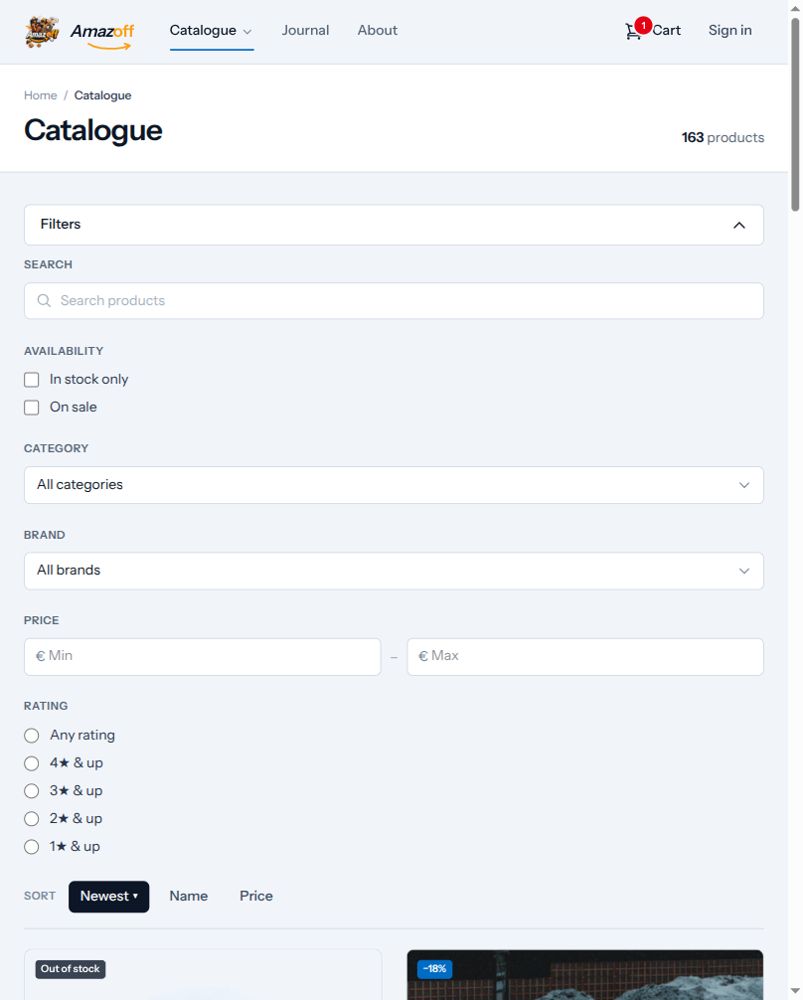
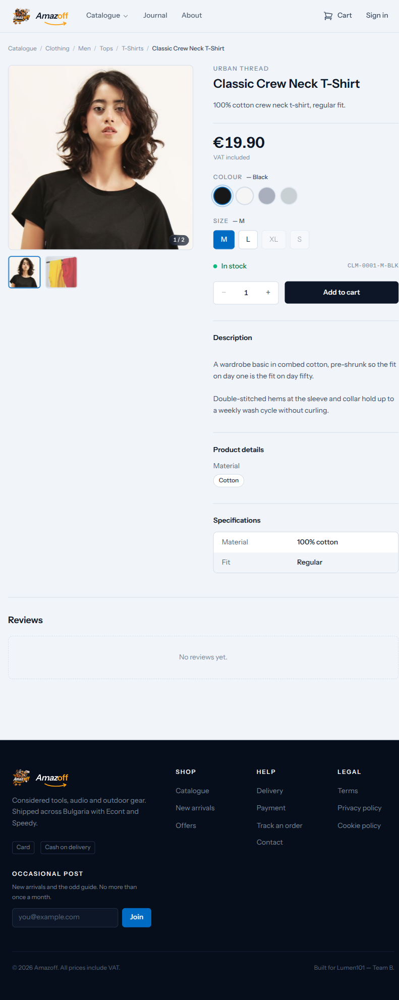
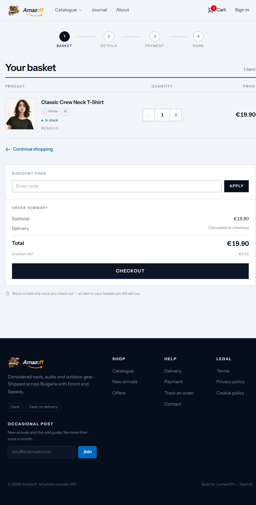
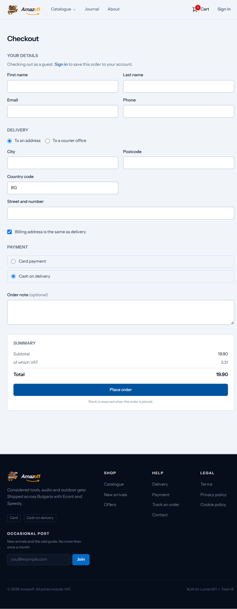
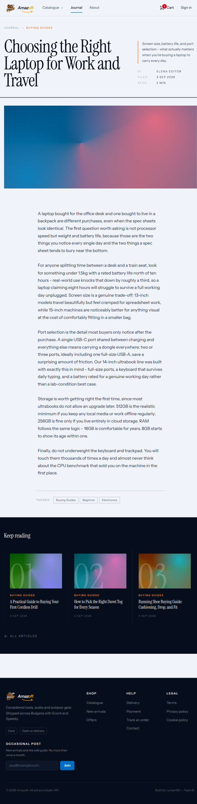
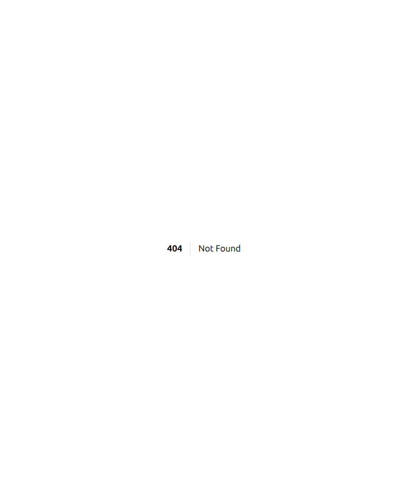

# Storefront UI testing — what was clicked, what held, what did not

Another page in the family `stripe-testing.md`, `browser-testing.md`,
`security-testing.md`, and `security-tooling.md` belong to: a dated record
of a manual pass, what it verified, and what it did not reach. Where those
pages focus on payments, responsive layout, and exploitable
vulnerabilities respectively, this one is the interactive storefront
walkthrough — every page a real customer reaches, clicked and abused the
way a person (or a careless bot) actually would, with each defined
behaviour it proves screenshotted rather than merely asserted.

**Date of record:** 2026-09-03. Driven live with the Playwright MCP
(`playwright-chromium`) against the running Docker stack, guest session,
demo catalogue seeded (162 products, 16 published articles).

## Method

For each page: navigate, screenshot, read the console (baseline is 4 errors
— the documented Vite-dev-server CORS noise, `browser-testing.md` has the
reasoning; anything beyond that baseline is a finding). Then abuse every
free-text and numeric input with the value playbook
`how-to/test-for-input-crashes.md` already establishes for this codebase —
oversized numbers, XSS-shaped strings, SQL-shaped strings, 5000-character
strings, empty values — and confirm the *server-side* record (order count,
user count, contact-message count) rather than trusting only what the page
displays.

## What held

### Catalogue — filters, sort, facets

Filters panel (search, availability, category, brand, price range, rating)
opens and every control is interactive; brand dropdown correctly lists all
34 real brands with per-brand product counts.

### Product detail — variant switching, gallery, add-to-cart

Colour and size swatches for unavailable combinations are correctly
`disabled` rather than clickable-but-broken. Switching colour updates the
URL (`?v=3`, a shareable variant link), the SKU, and the price together —
confirmed by reading the DOM after the click, not just visually. Add to
cart updates the header badge (`"Basket, 1 item"`) with no round-trip
error.

**Not present**: no "related products" section, despite §8–9 listing one;
no favourite/wishlist button; no review-submission form (only "No reviews
yet.", confirmed live — `CreateProductReview` exists as an Action but
nothing calls it from the storefront, tracked in `misc/todo.md`).

### Cart — quantity, discount code, totals

- Discount-code field: submitting `` produces a
  clean "That code was not recognised." with **zero unescaped reflection**
  in the response HTML.
- A 5000-character coupon string does not crash the apply action.
- A manually-injected oversized quantity (`999...` 34 digits, set directly
  on the Livewire component to simulate a crafted request) does not crash
  page load, and — checked server-side, not just visually — the displayed
  total stays a sane `€19.90` rather than reflecting the garbage value into
  the price calculation.

### Checkout — validation, guest flow, injection resistance

- Submitting with every field empty produces **7 specific, correctly-worded
  validation errors** ("The first name field is required.", etc.) and
  creates **no order row** — confirmed against `Order::count()` before and
  after, not inferred from the absence of a redirect.
- XSS-shaped first name, SQLi-shaped street address, and a 5000-character
  order note (which correctly hits its `max:500` rule) all produce clean
  validation or silent-safe storage — no reflection, no crash, no order
  created from the attempt.

### Journal — article listing and detail

This closes a gap `misc/todo.md` had marked open since 2026-09-01 — the
article/blog frontend is now fully built: 16 published articles, category
tabs, related-article suggestions, tags, byline. No raw `{!! !!}` anywhere
in the response, no XSS reflection tested against the render path.

### Registration and contact — the last two free-text surfaces

Both tested with the full abuse set (XSS-shaped, SQLi-shaped, 5000-char)
directly on the Livewire component (bypassing the browser's own input
limits, the way a crafted request would): clean validation, zero
reflection, zero unintended rows created — confirmed against
`User::count()` and `ContactMessage::count()` before and after each
attempt.

**Defined behaviour: the contact form's honeypot.** `website` is a hidden
field a real visitor never fills and a naive scraping bot does. Filling it
and submitting: the component reports `sent = true` (the bot sees a normal
success state, learns nothing) while **zero `ContactMessage` rows are
created** — confirmed directly against the table, not inferred from the
UI. This is the correct shape for a honeypot: silent discard behind a fake
success, not a rejection a bot could learn from and adapt to. A second,
genuine submission with the honeypot empty **is** stored — one row,
confirmed — so the fix path was verified working, not just the trap.

## What did not hold — two crashes, both fixed

Neither was found by clicking; both were found by sending the values a
click cannot produce (the URL bar, or a crafted request) — the exact reason
`test-for-input-crashes.md` tests properties, not only UI paths.

**`ProductList::$brandId`** and **`ArticleList::$categoryId`** — third and
fourth instances of this project's numeric-`#[Url]`-hydration incident
(`ProductDetails::$quantity`, `::$variationId` were the first two). A
34-digit number in `?brandId=` or `?categoryId=` produced an unhandled 500.
Both fixed the same session, each with 6 regression tests proven red
without the fix. Full detail: `reference/tested-inputs.md`, commits
`6378a4e` and `58eba11`.

## What did not hold — six dead links, unfixed

Every link in the footer's "Help" and "Legal" columns 404s. Confirmed live,
all six, `curl`-checked status codes, not inferred from the route list:
`/delivery`, `/payment-information`, `/orders/track`, `/terms`, `/privacy`,
`/cookies`.

**Defined behaviour of the 404 itself**: no stack trace, no debug
information — `APP_DEBUG` is correctly off — but also no site chrome, no
navigation back, no styling. A dead end in both senses. Logged as work for
a new session in `misc/todo.md`'s P7, alongside the missing-pages inventory
below.

## The missing-pages inventory — §4–5 against what actually exists

Checked systematically with `curl`, one request per candidate path, status
codes only — not inferred from the route list, since a route existing does
not mean a link to it exists anywhere, and a link existing (the footer)
does not mean the route does.

| Path | Status | §4–5 requirement |
|---|---|---|
| `/` | `302` → `/catalogue` | Home page — redirect only, standard #4 "Not met" |
| `/account/profile`, `/account/orders`, `/account/addresses` | `404` | Customer profile, order history |
| `/password/reset` | `404` | Password reset |
| `/wishlist` | `404` | Wish list (§38; `wishlist_items` table exists, no UI) |
| `/orders/track` | `404` | Order tracking |
| `/delivery`, `/payment-information` | `404` | Delivery/payment information |
| `/faq`, `/terms`, `/privacy`, `/cookies` | `404` | FAQ, terms, privacy, cookie policy |

`/about` returns `200` and renders cleanly via a plain `Route::view()` —
proof the six static pages (`/delivery` through `/cookies`) are a content
gap, not a technical one; the pattern to close them already exists and
works in this same file.

## Not covered by this pass

- **The admin panel's UI**, beyond what the security scans already probed
  (`reference/security-tooling.md`). This pass is the public storefront.
- **Filament resource forms** — creating/editing a product, an order status
  change, and so on — `misc/todo.md`'s "Not yet covered" section already
  names this as open.
- **Real devices and a second browser engine** — same limitation
  `browser-testing.md` states; this pass used the same Chromium instance.
- **Every product page**, not a sample — 162 products exist; this pass
  exercised the interaction patterns on a handful, not an exhaustive sweep.
- **The full input-abuse playbook against every remaining free-text
  field** — `#[Url]`-bound numeric properties got the systematic
  codebase-wide grep (`tested-inputs.md`); free-text fields were tested
  where encountered during the click-through, not swept exhaustively.
