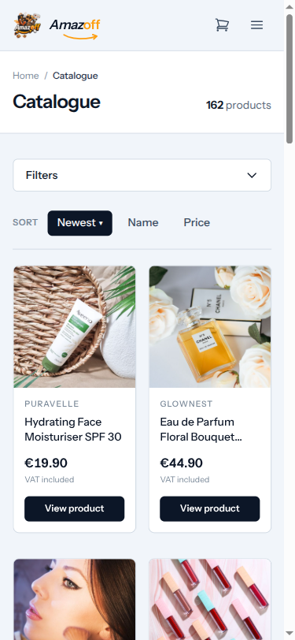
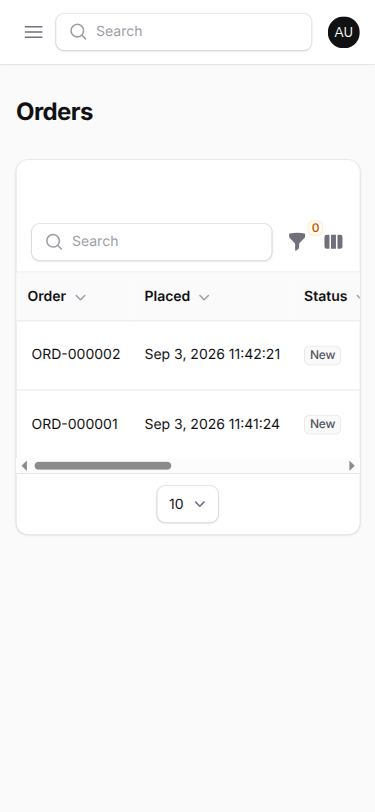

# Browser testing — what a real browser proves that Pest cannot

Everything under `tests/Feature` and `tests/Unit` runs without a browser.
Pest renders no layout, `Livewire::test()` executes no CSS, and Larastan
reads types rather than pixels. That leaves a class of requirement none of
them can reach — §37 #19 ("responsive, desktop and mobile") being the
graded example.

Since 2026-09-09 there is an **automated** browser suite, `tests/Browser/`
(ADR-0017), on top of the manual MCP passes this page originally recorded.
The two are complementary: the automated suite is the regression net that
runs on every change; the manual passes are the exploratory, screenshot-
against-the-claim work that finds what no assertion was written for.

## The automated suite (`tests/Browser/`)

`pestphp/pest-plugin-browser` (Pest 5) boots the Laravel application
**in-process** and drives a real Chromium against it. So a browser test
runs in the same process as its own `factory()` calls and DB assertions,
but exercises the full JS / Livewire / Vite layer a Feature test skips.

Run it through the opt-in `playwright` Compose service — never part of
`docker compose up`, and not in a bare `pest` run:

```
docker compose run --rm playwright ./vendor/bin/pest -c phpunit.browser.xml
```

| Spec | What it proves |
|---|---|
| `SmokeTest` | Every public storefront route, the signed-in account pages, and the admin dashboard load with no server error and no JavaScript console error. Pages are visited in batches (`visit([...])`) — Pest tears down a browser context per `it()`, so one batched test is ~15s where 20 separate ones are ~5min. |
| `ResponsiveTest` | §37 #19. At 375 / 768 / 1440 px, no element and no document overflows its viewport horizontally on any of ten storefront pages. Each case first asserts compiled Tailwind actually applied (a probe element must compute `display:grid` and `padding-left:16px`) — an overflow check on an unstyled page is a false pass, so it fails loudly there instead. Decorations deliberately drawn outside an `overflow-hidden` box are not counted. |
| `CookieConsentTest` | Clicking **OK** or **Decline non-essential** hides the cookie notice on the spot, `document.cookie` holds `cookie_consent=accepted`/`rejected`, and the next page load renders no notice — which is only possible if the cookie reached the server unencrypted. Added after the buttons were found to remove only themselves (`this.$el` inside an `x-data` method called from `x-on` is the clicked button); a Feature test cannot see this, because the notice is removed in the browser, not by the server. |
| `CheckoutLifecycleTest` | The system-simulation E2E. One guest order in one browser session: catalogue → product → add to cart → cart → checkout → place (COD) → confirmation → tracked. The cart is built by clicking the real Livewire button; the order is placed by submitting the real checkout form; the DB is asserted against between steps. The four status hops to `Shipped` call `TransitionOrderStatus` directly (the Filament path is four stacked confirmation modals, and a driver that awaits a modal call never returns — `ui-testing/phase-4-admin-panel-clickthrough.md`); a browser assertion confirms staff then see the finished order in the panel. Courier is the deterministic `FakeCourierGateway`. |
| `ThreeDSecureTest` | **Local-runbook-only, not run in CI.** The SCA challenge flow with a real Stripe test key: real checkout, real Stripe Elements, `4000 0025 0000 3155`, the real hosted 3DS2 challenge completed in a real browser (its `challenge=allow` form submitted — Playwright's click does not trigger native submission there; `stripe-testing.md` has the measured detail), then a constructed-and-signed `payment_intent.succeeded` webhook (not `stripe listen` — see `stripe-testing.md` for why) proving `payments` reaches `Paid` and `payment_events` idempotency. `->markTestSkipped()` when `STRIPE_SECRET`/`STRIPE_WEBHOOK_SECRET` are not real test-mode values. |

Key wiring facts, all in `tests/Pest.php`'s Browser block and
`phpunit.browser.xml`:

- **No refresh trait.** A browser page load is a committed round-trip. The
  suite runs against its own database (`amazoff_browser`), truncates every
  data table and reseeds `Permission`/`Role`/`Carrier` before each test —
  the `tests/Concurrency` model.
- **`@vite` is forced onto the built manifest.** The in-process server has
  no route to the Vite dev server on `:5173`; if `public/hot` exists (the
  `vite` Compose service is running) `@vite` would serve raw
  `resources/css/app.css` and every page would render unstyled. The
  `beforeEach` points the hot-file path at a nonexistent file.
  `public/build/` must be current — the CI browser job runs `npm run build`
  first; locally, run it if `ResponsiveTest`'s styles precondition fails.
- **Nested `Pest.php` is never loaded by Pest** — the Browser binding lives
  in the root `tests/Pest.php`, not `tests/Browser/Pest.php`.

## The manual MCP passes — what a real browser proves that Pest cannot

The rest of this page records the manual browser tooling, how it is wired
against a Dockerised app, what it verified, and — as `stripe-testing.md`
does for payments — what it did **not** cover and why. A pass here is a
claim about one browser at three widths on one machine, not a claim about
every device.

## The tooling

| Piece | What it does |
|---|---|
| `@playwright/mcp` | An MCP server exposing browser control as tools: navigate, resize, click, evaluate JavaScript, screenshot |
| Chromium (`chromium-1243`) | The browser it drives. Downloaded into `~/.cache/ms-playwright/`, not a system package |
| `chrome-devtools-mcp` | A second server for *why* rather than *whether* — performance traces, network waterfall, console with source-mapped stacks |

Both run on the **host**, not inside the `app` container, and reach the
application the same way a developer's own browser does — over the port
`docker-compose.yml` publishes.

### Why this project declares its own Playwright server

The marketplace `playwright` plugin ships one line of configuration:

```json
{ "playwright": { "command": "npx", "args": ["@playwright/mcp@latest"] } }
```

With no `--browser` flag the server looks for **real Google Chrome** at
`/opt/google/chrome/chrome`. Installing that is a system `.deb` and needs
`sudo`; Chromium does not. So `.mcp.json` declares a project-scoped server
instead:

```json
"playwright-chromium": {
  "command": "npx",
  "args": ["-y", "@playwright/mcp@latest", "--browser", "chromium"]
}
```

Committed, so every developer gets the working configuration rather than the
one that fails on a machine without Chrome. The marketplace plugin is
disabled in `.claude/settings.json` to avoid two servers competing for the
same job.

`docs/how-to/set-up-claude-code.md` has the install path, including the Node
prerequisite that is easy to miss — both servers launch through `npx`, and
without Node on the host they fail with a message naming only the retry
policy, never the cause.

## What was verified, 2026-09-02

Four pages at three widths, against the running stack at
`http://localhost:8080` with the demo catalogue seeded (169 products, 219
variations).

| Page | 375 px | 768 px | 1440 px |
|---|---|---|---|
| `/catalogue` | pass | pass | pass |
| `/products/{slug}` | pass | pass | pass |
| `/cart` (holding an item) | pass | pass | pass |
| `/checkout` | pass | pass | pass |

"Pass" means, measured rather than eyeballed: `documentElement.scrollWidth`
never exceeded `clientWidth`, and **no element's right edge crossed the
viewport boundary** — the check walks every node in the document and
compares `getBoundingClientRect().right` against `clientWidth`.

The nominal widths are the window; the figures the page actually saw were
**361 / 753 / 1425 CSS px**, the remainder being scrollbar. Those are the
numbers the assertions used.

Also confirmed at 375 px:

- the catalogue grid responds — one column, then three by 768 px
- the mobile navigation toggle works: `aria-expanded` flips `false` → `true`
  and 14 navigation links become visible
- checkout's 15 form inputs all fit, none clipped



### Two findings, neither a failure

**Tap targets below 24 px.** Fifteen on the product page: four breadcrumb
links, ten footer links, and the skip-link — which is *correctly* 1 px until
focused and is not a defect. WCAG 2.5.8 asks for 24 × 24 CSS px.

Scoped before being reported: **no primary action is undersized.** "Add to
cart", the variation pickers, and the checkout controls are all comfortably
above the threshold. The gap is navigation chrome, worth a pass of its own
rather than a blocker.

**Resolved** (`ffdadfa`, 2026-09-09): footer links and breadcrumbs now carry
`min-h-[24px]`/`-my-1 py-1`. Re-measure before closing — this note records
the fix landing, not a re-run of the 375/768/1440 px check above.

**The catalogue grid stops widening at three columns.** It reaches three by
768 px and stays there through 1425 px, so a wide desktop shows more gutter
than product. An `xl:` breakpoint at four or five columns would use the
space. Nothing is broken; the layout is simply not earning the width.

**Resolved**: `product-list.blade.php` now reads
`grid-cols-2 ... lg:grid-cols-3 xl:grid-cols-4`, added after this pass ran.
That base case is also inconsistent with "one column" at 375 px above
(line 128) — worth a re-run of this page's measurement, not just a note,
since the grid shape changed since 2026-09-02.

## The check that came first

The catalogue reported four console errors on load:

```
Access to script at 'http://localhost:5173/resources/js/app.js'
blocked by CORS policy
```

That is the Vite dev server, and it mattered before any measurement could be
trusted: **if the stylesheet had not loaded, every "no overflow" result
would have been measuring an unstyled document** — which never overflows,
and would have produced a page of false passes.

So the styling was confirmed present before the results were believed: four
stylesheets attached, the `Instrument Sans` face resolved rather than
falling back, Alpine and Livewire both defined on `window`, twenty product
cards rendered, and the grid container computing `display: grid`. The failed
requests are a duplicate fetch; the assets that matter arrived.

This is the browser-side form of the rule the rest of this project already
applies to tests: a green result whose mechanism was never confirmed proves
nothing.

## Second pass, 2026-09-03 — new pages and the admin panel

A follow-up run after the storefront grew and the admin panel came into
scope. Same method: styles confirmed loaded before every measurement (4
storefront stylesheets, 9 in the panel; grid computing `grid`; `Instrument
Sans` resolved), then the walk-every-node overflow check.

| Page | 375 px | 768 px | 1440 px |
|---|---|---|---|
| `/catalogue` | pass | — | pass |
| `/products/{slug}` | pass | — | — |
| `/cart` (holding items) | pass | — | — |
| `/journal` (index) | — | pass | — |
| `/journal/{slug}` (article) | pass | — | — |
| `/admin/orders` (Filament table) | pass | — | — |

"Pass" is the same measured claim as above: `scrollWidth` never exceeded the
viewport, and no element's right edge crossed it. The journal index and
article pages are **new since the first pass** and clean at the widths
checked.

The **admin panel was swept for the first time** — the first pass explicitly
did not. At 375 px `/admin/orders` has no body-level horizontal scroll; the
only content wider than the viewport is inside Filament's own table
scroller, which is the correct pattern (the table scrolls within its
container, the page does not). Filament ships this behaviour; this confirms
it holds here rather than assuming it.



Still not swept: the other admin resources, and the panel at tablet/desktop
widths — only the data-heaviest table was checked, on the assumption that if
any panel view overflowed the body it would be a wide table, and it did not.

## What this does not cover

Stated plainly, in the same spirit as `stripe-testing.md`'s own list of
gaps.

- **One browser.** Chromium only. No Firefox, no WebKit — so no Safari, and
  iOS Safari is a large share of real mobile traffic.
- **No real devices.** A resized desktop viewport is not a phone. Touch
  scrolling, on-screen keyboards resizing the viewport mid-form, and
  device-pixel-ratio rendering are all unexercised.
- **Portrait only.** No landscape orientation at any width.
- **No text zoom.** Browser zoom to 200 % is a WCAG requirement and was not
  tested.
- **Four pages.** The article frontend (`App\Livewire\Journal`), order
  tracking (`App\Livewire\Orders\TrackOrder`), and the account pages
  (`App\Livewire\Account`) all exist but were not part of this pass — this
  gap is about pass coverage, not missing features.
- **The admin panel was not swept.** Filament ships its own responsive
  behaviour; §37 #19 is about the storefront.
- **Layout only.** Colour contrast is now covered — see
  `accessibility-testing.md` (2026-09-14, `axe-core` against the storefront
  critical path: one structural bug found and fixed, a systemic
  colour-contrast failure found and recorded, not yet fixed). Focus order
  and screen-reader output are still not audited.

## Repeating it

Bring the stack up first — the browser reaches the app over the published
port, so nothing works against a stopped container:

```bash
docker compose up -d
docker compose exec app php artisan migrate:fresh --seed
docker compose exec app php artisan db:seed --class="Database\Seeders\Demo\DemoSeeder"
```

Then drive the browser through the `playwright-chromium` tools: resize,
navigate, and evaluate the overflow check against each page. The measurement
is a single expression over `document.querySelectorAll('*')` comparing each
rect's `right` to `clientWidth`; it is deliberately not a screenshot
comparison, because a screenshot diff fails on every unrelated content
change while proving nothing about layout.

Session output — console logs, snapshots, screenshots — lands in
`.playwright-mcp/`, which is gitignored. A screenshot worth keeping goes to
`docs/assets/` by hand, as the one above did.
