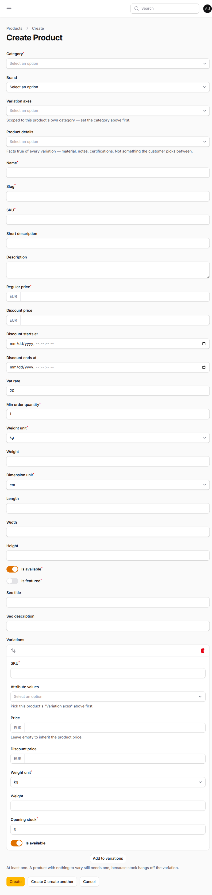
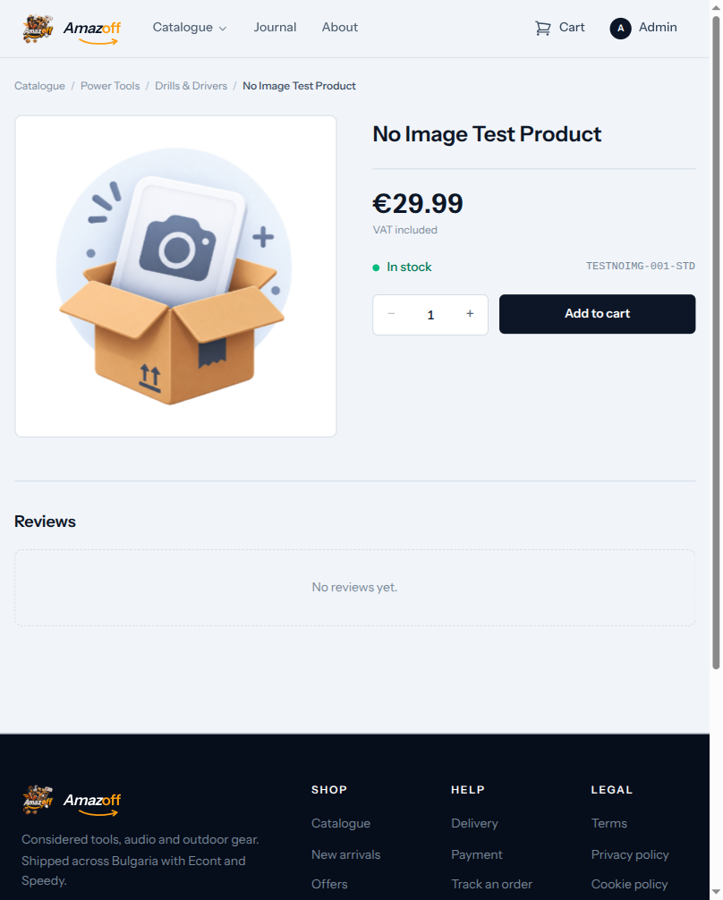
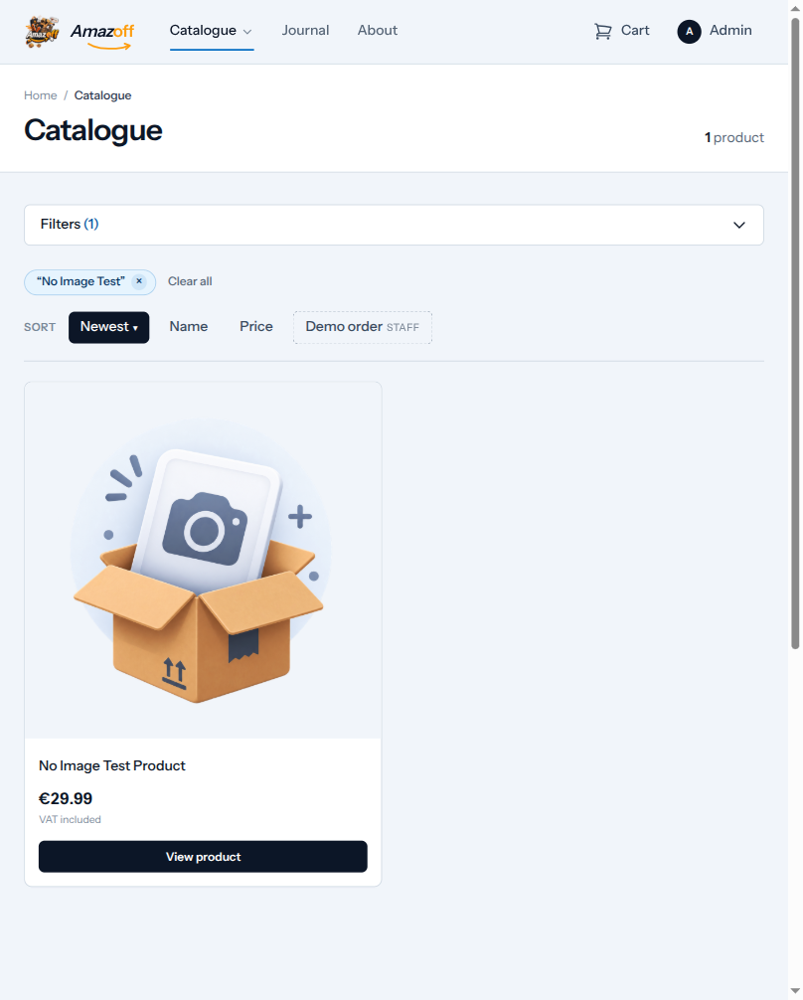
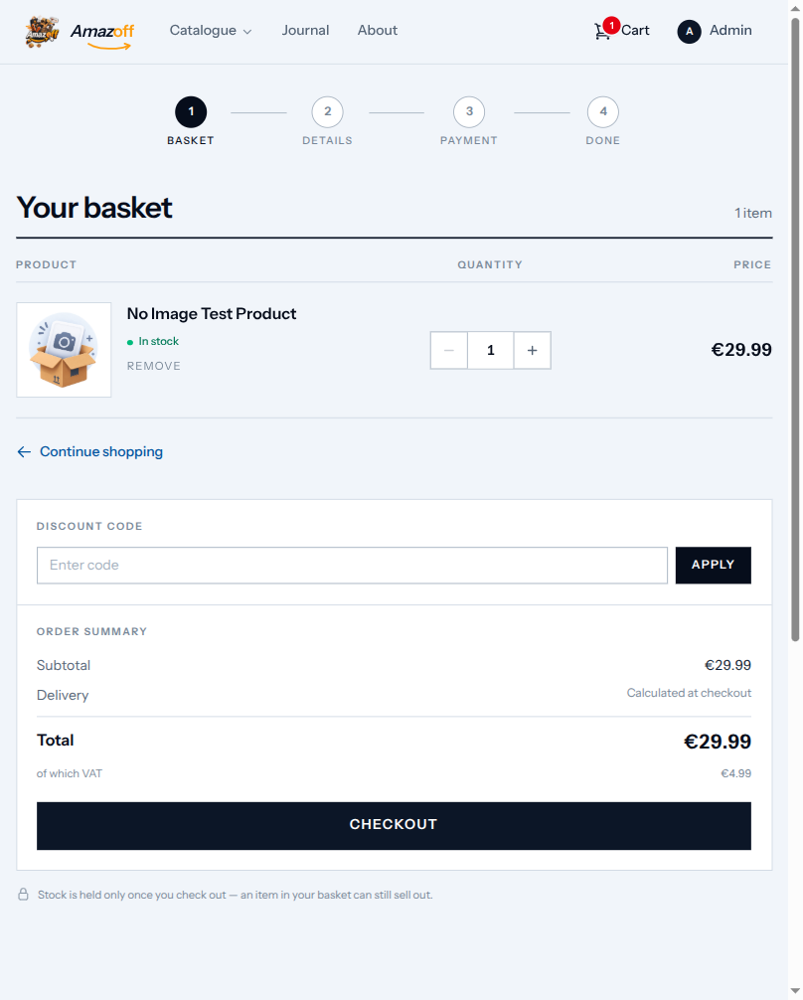
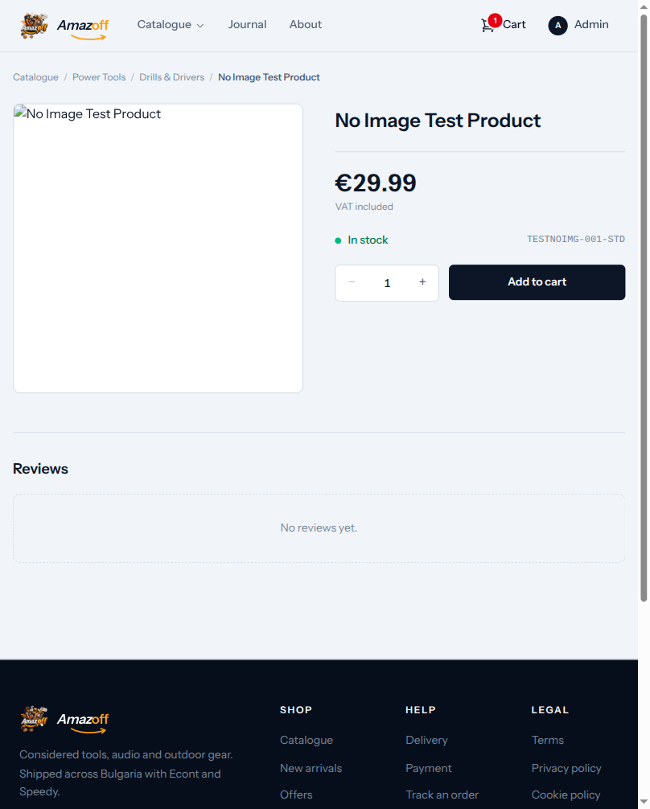

# Phase 2 — admin-created data: what the storefront does with it

Companion to Phase 1 (`phase-1-storefront-clickthrough.md`), same
discipline from the other side: rather than abusing what a *customer* can
type, create genuinely broken catalogue data the way a real admin session
could — through the actual Actions Filament's own forms call, not a
factory shortcut — and watch what a customer's browser does with it. §37's
own criterion #1 ("an administrator can create and manage products") says
nothing about *bad* products, and nothing in `ProductForm` requires an
image.

**Date of record:** 2026-09-03, same session and stack as Phase 1.

## What held — a product with zero images

**A fully valid, priced, in-stock product, with zero images**, created
through `CreateProduct` exactly as an admin form submission would call
it — not a factory shortcut.

This one **already worked correctly**, on all three storefront surfaces —
worth recording as a clean result, not only the breaks:

| Surface | Result |
|---|---|
| Product detail |  |
| Catalogue card |  |
| Cart |  |

`ResolveVariationImage::urlOrDefault()` (cart) and each Blade template's own
`@if ($image) … @else` branch (catalogue, product detail) both already
handle "this product has no `product_images` row at all" — the
`default-product.png` asset that ships with the app renders everywhere,
console stays at the 4-error baseline throughout.

## What did not hold — a row exists, its file does not

**Not fixed by any of the above.** A `product_images` row is not a promise
its file is really on disk — a row created (or left behind by a failed
upload, a manual disk change, a database restore against a fresh disk)
pointing at a path nothing was ever written to. Confirmed by creating
exactly that row directly against the running database, the state any of
those real causes converges on.

Console jumped from the 4-error baseline to 5 — `Failed to load resource:
the server responded with a status of 403` against the missing path — on
**every one of the three surfaces**: product detail, catalogue card, and
the cart. The cart's own fallback helper did not save it, because
`ResolveVariationImage::current()` only asks "does a row exist," never
"does the file behind it." A row existing was enough to skip the "no image"
branch entirely and attempt a real `` that could not resolve.

**Fixed the same session**, per the standing instruction that a missing or
unloadable image should fall back to the default one everywhere, not show
as broken: `ProductImage::servableUrl()` — a new method, the single place
this decision is now made — checks `Storage::disk(self::DISK)->exists()`
before building the URL, falling back to `default-product.png` when the
file genuinely is not there. Wired into all three render sites (the two
Blade templates that previously called `Storage::url()` raw, and
`ResolveVariationImage::urlOrDefault()`, which now defers to the model
method instead of duplicating the check).

Console back to the 4-error baseline on all three. 8 regression tests in
`tests/Feature/Support/ResolveVariationImageTest.php`, 2 of them new and
proven red without the fix (reverting `servableUrl()` to skip the disk
check reproduces the exact same test failures the live bug produced). The
existing "resolves the gallery image to a storage URL" test was itself
quietly relying on a row's path never being checked against a real
file — fixed alongside, to actually write the file to the fake disk the
way a real upload does, rather than weaken the new check to keep it green.

Full detail and the fix's own reasoning: `app/Models/ProductImage.php`'s
`servableUrl()` docblock.

## Not covered by this pass

- **Deleting a non-nullable attribute mid-edit** — planned, not yet run.
  The schema's own `CHECK`/`NOT NULL` constraints (`docs/reference/schema/`
  and ADR-0005) make most of these fail at the database rather than
  silently corrupt, which changes what "broken" looks like here: a form
  error or a `QueryException`, not a rendering gap. Worth running to
  confirm the *form* refuses cleanly before the database ever has to.
- **A malformed-format image upload** (wrong MIME, undersized dimensions)
  — `ProductImage::ACCEPTED_MIME_TYPES` and `MIN_WIDTH_PX`/`MIN_HEIGHT_PX`
  exist precisely to refuse this at the Filament widget, before it ever
  becomes a row; not independently re-verified this pass.
- **Every other resource** — this pass covered products and their images
  only. Articles, coupons, categories, and the rest of Filament's forms are
  still open, per Phase 1's own "not covered" section.
  **Partly closed by Phase 4** (`phase-4-admin-panel-clickthrough.md`),
  which swept the panel's role denial and its destructive actions across
  every resource; the deleting-a-non-nullable-attribute case above is
  answered there, and turned out to be one instance of a wider finding.
