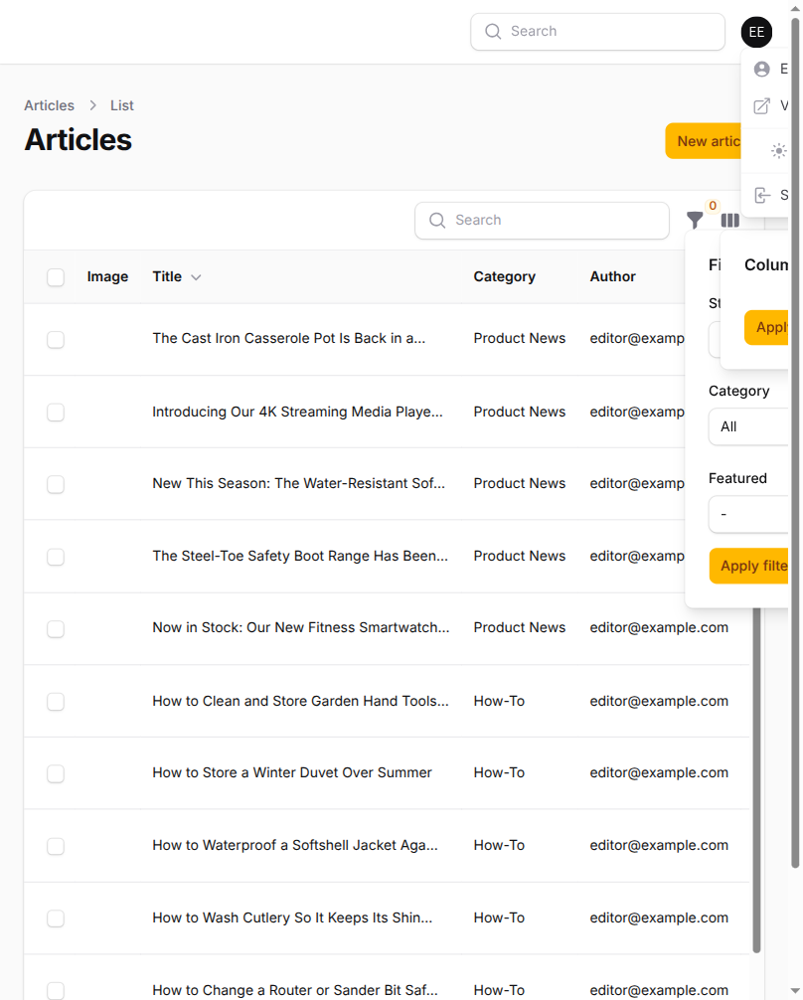
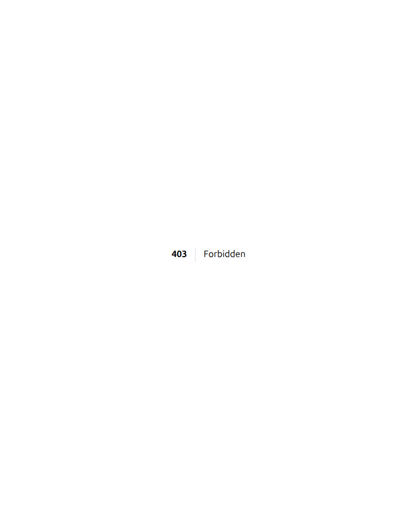

# Phase 4 — admin panel click-through: forms, refusals, and role denial

Fourth in the family Phase 1 (`phase-1-storefront-clickthrough.md`), Phase 2
(`phase-2-admin-created-data.md`) and Phase 3 (`phase-3-error-leak-sweep.md`)
belong to. Where Phase 1 drove the storefront as a customer and Phase 2
created broken catalogue data from the admin side to watch what the customer's
browser did with it, this pass stays inside the panel: what a staff member can
reach, what the forms refuse, and what an ordinary destructive click produces.

It closes the gap all three earlier passes named in their own "not covered"
sections — Phase 1's *"clicking through Filament's forms field by field ... is
still open"*, Phase 2's *"every other resource ... still open"*, and Phase 3's
*"form-submission paths, Filament resource actions ... were not swept the same
way"*.

**Date of record:** 2026-09-04. Driven against the running Docker stack with
the Playwright MCP (`playwright-chromium`) for the browser half, and through
the real Actions and HTTP kernel for the write half. Demo catalogue seeded
(171 products, 24 articles, 9 attributes, 35 brands, 2 orders).

## Method, and one thing it changed

Two seams, deliberately, because they answer different questions:

- **The browser**, for what a staff member actually sees — which resources
  appear in the sidebar, and what a forbidden URL returns.
- **The Actions and the HTTP kernel directly**, for every write. Filament's
  destructive actions open a confirmation modal, and a driver that awaits
  such a call never returns; one probe in this pass hung for the full
  30-minute MCP idle timeout on exactly that. More importantly, a modal
  click proves the *button* works, while the question worth answering is
  whether the rule underneath it holds against a request that never saw the
  button. Every write below was therefore run inside a transaction that
  rolls back, against the same Action the panel calls.

**Every destructive probe was rolled back and the row counts re-checked
afterwards** (`attributes=9 brands=35 carriers=2 articleCats=4 shipments=0
articles=24`, unchanged). One live click was refused by the harness's own
auto-mode classifier — a real `Delete` on seeded data — and was not retried;
the same case is answered below through the rolled-back path instead.

## What held

### Role denial — §37 #18, all 19 resources × 4 accounts

Every admin resource requested **by URL** as each seeded account. A hidden nav
link is not access control, so the route is what was probed. Complete results
are in `reference/testing/security-testing/what-held.md` ("Role-based access
control"), which this pass extended from 13 routes to all 19; the summary is
that each role reaches exactly what the permission catalogue grants it and
nothing else:

- `content_editor` — `articles`, `article-categories`, `tags`. Nothing else.
- `warehouse_employee` — `orders`, `shipments`, `inventories`, `carriers`.
- `customer` (no role) — refused the panel outright, `/admin` itself 403.

Confirmed in a real browser, not only at the kernel: signed in as
`editor@example.com`, the sidebar renders exactly three resources.

And a forbidden resource is a real 403 page, not a missing link:

### The article status menu is enforced, not merely hidden

Phase 1 established that the storefront's guards are load-bearing; this is the
panel-side equivalent for `ArticleStatus`. `PublishArticle` was called
directly, bypassing the menu entirely, in three configurations:

| Case | Actor | Move | Result |
|---|---|---|---|
| A | `content_editor` (authorized) | `archived → scheduled` (**illegal**) | refused — `ArticleTransitionNotAllowedException` |
| B | `warehouse_employee` (**unauthorized**) | `archived → published` (legal) | refused — `AuthorizationException` |
| C | `content_editor` (authorized) | `archived → published` (legal) | **accepted** |

C is the control and it is the part that makes the other two mean anything: if
all three had been refused, the refusals would prove only that the call was
broken. The split shows the matrix (ADR-0004) and the policy each doing their
own job — one refusing an illegal move regardless of who asks, the other
refusing a legal move by the wrong actor. The article was restored to
`archived` afterwards.

The same shape was verified by reading for `OrderStatus`:
`TransitionOrderStatus` re-checks legality *and* calls
`Gate::forUser($actor)->authorize()` inside the row lock, ordered so a denied
actor sees `AuthorizationException` even when the move is already done —
which is what keeps a self-transition from leaking whether the move would
have been legal.

### Price and numeric abuse — refused by the database, not by the form alone

`products.regular_price` driven through `CreateProduct`, each attempt in a
rolled-back transaction:

| Submitted | Result |
|---|---|
| `-5.00` | refused — `CHECK chk_products_regular_price_non_negative` |
| `1e20` | refused — column out of range |
| `"abc"` | refused — not a valid decimal |
| `0` | accepted, stored `0.00` |
| `1.123456` | accepted, stored `1.12` |
| `19.99` (control) | accepted, stored `19.99` |

The two acceptances are correct rather than gaps. A zero price is a real
business state, and the non-negative `CHECK` is what guards the actual error;
extra precision is narrowed by the `decimal(10,2)` column, which is the
documented behaviour and the right one for money (`1.999` → `2.00`).

**A false result caught mid-pass, recorded because it is the trap this kind of
sweep invites.** The first run of this table reported all five values
"refused", which read as a clean pass. They were refused — on a missing `sku`,
because the probe's variation payload used the wrong key shape, so the price
column was never reached at all. The control row (`19.99`, which must be
*accepted*) is what exposed it: without a case that is required to pass, a
probe that never reaches the code under test is indistinguishable from a
defence that works. Every table in this document therefore carries a control.

## What did not hold — a foreseeable click produces an uncaught `QueryException`

**Six Filament resources expose a bare `DeleteAction::make()` on a table other
rows point at.** Deleting such a row is refused by the database with MySQL
error 1451, which reaches the panel as an unhandled `QueryException` — an
Ignition debug page with `APP_DEBUG=true`, a bare 500 in production — rather
than as a message naming what blocked it.

Confirmed live, each inside a rolled-back transaction:

| Resource | Blocked by | Result |
|---|---|---|
| `EditAttribute` | `attribute_product` | BLOCKED → FK 1451 uncaught `QueryException` |
| `EditBrand` | `products` | BLOCKED → FK 1451 uncaught `QueryException` |
| `EditArticleCategory` | `articles` | BLOCKED → FK 1451 uncaught `QueryException` |
| `EditCarrier` | `shipments` | BLOCKED → FK 1451 uncaught `QueryException` |
| `EditCoupon` | `coupon_redemptions` | BLOCKED → FK 1451 uncaught `QueryException` |

`EditCarrier` and `EditCoupon` each needed their blocking child row created
first — neither a shipment nor a redemption is seeded — so both are proven
rather than inferred from the schema. All five confirmed.

**This is not a missing decision — it is an applied decision that stopped
half-way.** `EditProduct` and `EditProductCategory` already solve exactly this,
routing their `DeleteAction` through an Action wrapped in
`ReportsDomainFailures`. `EditProductCategory`'s own docblock names the failure
verbatim:

> the default action's raw `$record->delete()` surfaces the
> `parent_id`/`product_category_id` foreign key as an uncaught
> `QueryException` instead of a message naming which dependency blocked it

The pattern exists, is documented, and was applied to 2 of the 6 resources that
need it. The other 4 were never revisited.

**Why `ReportsDomainFailures` alone does not fix it**, and why this needs a
decision rather than a patch: the trait deliberately refuses to catch a
`QueryException`, and says so —

> A `QueryException` or a `TypeError` is a defect rather than a refusal, and
> swallowing those into a toast would hide exactly the failures that should be
> loud.

That reasoning is right and should not be weakened. The fix is the one
`EditProduct` and `EditProductCategory` already use: check the dependency in an
Action and throw a **domain** exception naming it, so the trait has something it
is willing to catch. Widening the trait to swallow `QueryException` would close
this symptom by breaking the rule that makes real defects visible.

### The bulk path bypasses the guard even where the single path has one

**13 resources expose a bare `DeleteBulkAction::make()`**, and this is worse
than the finding above rather than a repeat of it: `DeleteBulkAction` calls
`$record->delete()` per record, so it bypasses the Action the *single* delete
was deliberately routed through.

`ProductCategories` is the case that proves it. Its `EditProductCategory`
correctly routes through `DeleteProductCategory`, which locks the row, counts
children and products, and throws `ProductCategoryCannotBeDeletedException`
naming the blocker. Its table's bulk delete reaches none of that:

| Path | Same in-use category |
|---|---|
| Single delete (`EditProductCategory` → `DeleteProductCategory`) | domain exception naming the dependency |
| **Bulk delete** (`DeleteBulkAction`) | **BLOCKED → FK 1451 uncaught `QueryException`** |

`Brand` behaves identically, and `Products` is a third shape worth noting: a
product **deleted cleanly** under the bulk path, because `Product` soft-deletes
— so the bulk action silently succeeds where `DeleteProduct`'s own refusals
would have applied. That is not a crash; it is a guard skipped without any
error at all, which is harder to notice than a 500.

The generalisation: **routing a resource's single delete through an Action does
not protect it**, because the bulk action is a second, independent call site
that Filament wires up by default. Any resource whose delete carries a rule
needs both paths routed, and the bulk one is the one nobody remembers.

> **Resolved 2026-09-08.** `App\Filament\Actions\DomainDeleteBulkAction` now
> routes the bulk path through the per-record Action on all seven rule-bearing
> resources, with a partial and an all-or-nothing entry. See
> `docs/reference/actions.md` "Bulk delete composes with the per-record
> Action" and `DomainDeleteBulkActionTest`.

**Severity: low, and bounded.** It is a staff-only surface, the delete is
correctly refused, and no data is lost or corrupted — the database is doing its
job. The `Products` soft-delete case is the exception worth watching: there the
write *succeeds*, so "no data lost" holds only because the delete is reversible. What is wrong is the failure *shape*: a foreseeable administrative action
produces a stack trace instead of "Brand could not be deleted — 12 products use
it." Under `APP_DEBUG=false` it degrades to a bare 500, which is worse to
diagnose, not better.

Recorded here rather than fixed in this pass: four resources each need a
delete Action with its own dependency check, which is a vertical slice of its
own, and CLAUDE.md's standing instruction is not to commit unasked.

## Not covered by this pass

- **A malformed-format image upload** (wrong MIME, undersized dimensions) —
  still not independently re-verified, the same item Phase 2 deferred.
  `ProductImage::ACCEPTED_MIME_TYPES` and `MIN_WIDTH_PX`/`MIN_HEIGHT_PX`
  exist to refuse it at the widget; per CLAUDE.md's testing rule, what is
  worth confirming is that the right constant reached the right method, which
  Larastan already enforces — not that Filament's own `acceptedFileTypes()`
  works.
- **Filament's own form plumbing** — field-by-field validation of every input
  on every resource. This pass drove the *writes* those forms perform and the
  refusals underneath them, not each widget's client-side behaviour, which is
  upstream's to secure and upstream's to test.
- **The `warehouse_employee` panel click-through in a browser.** Its route
  access is proven at the kernel (the matrix above) and its order-status
  authorization by reading `TransitionOrderStatus`, but its screens were not
  driven live the way `content_editor`'s were.
- **Relation managers** (`ProductVariations`, `ProductImages`,
  `ProductSpecifications`) — reached only indirectly through `CreateProduct`.
